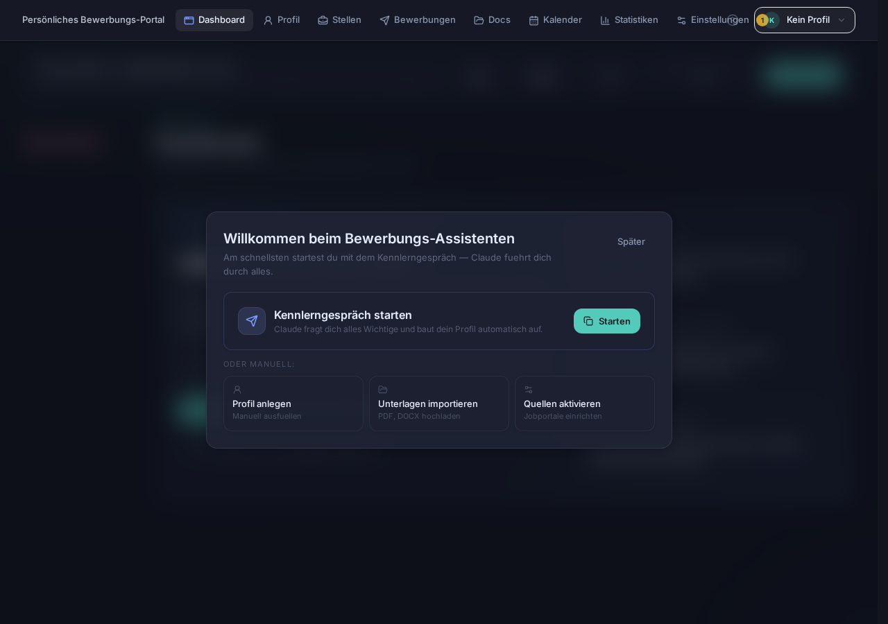
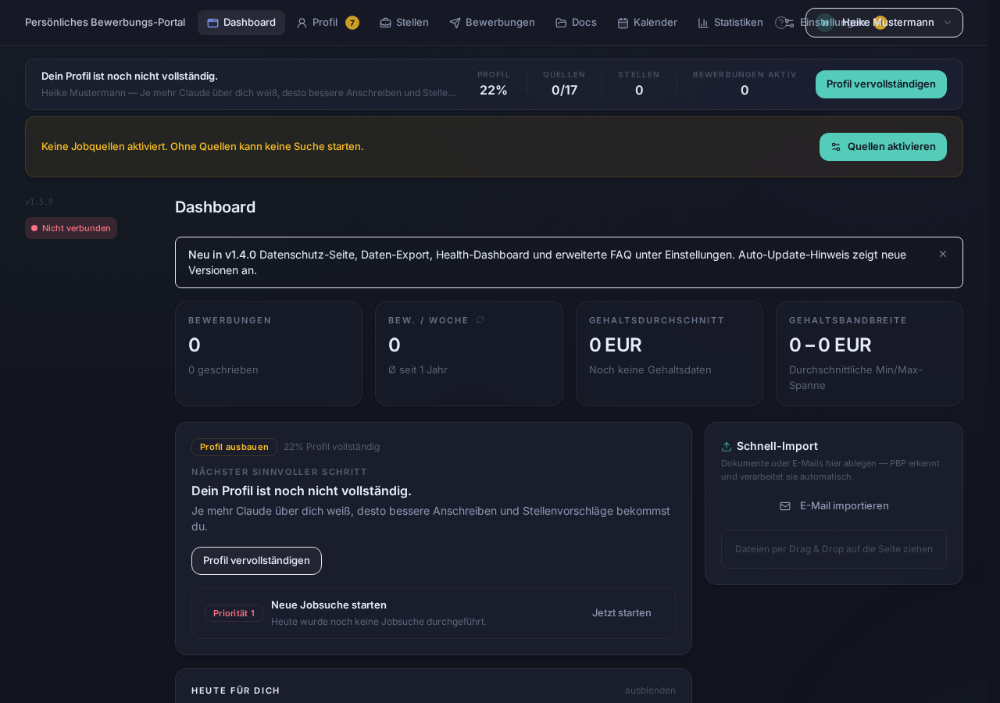
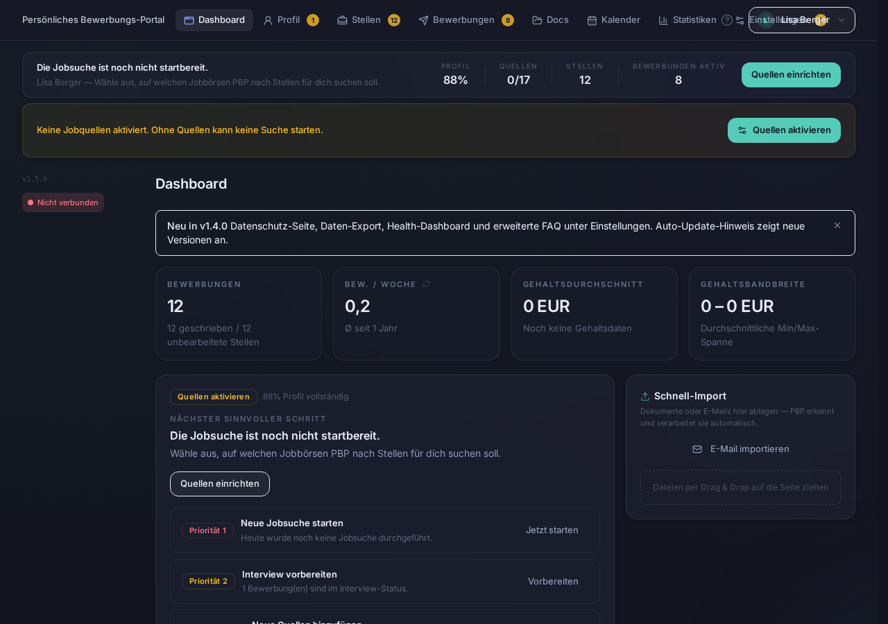
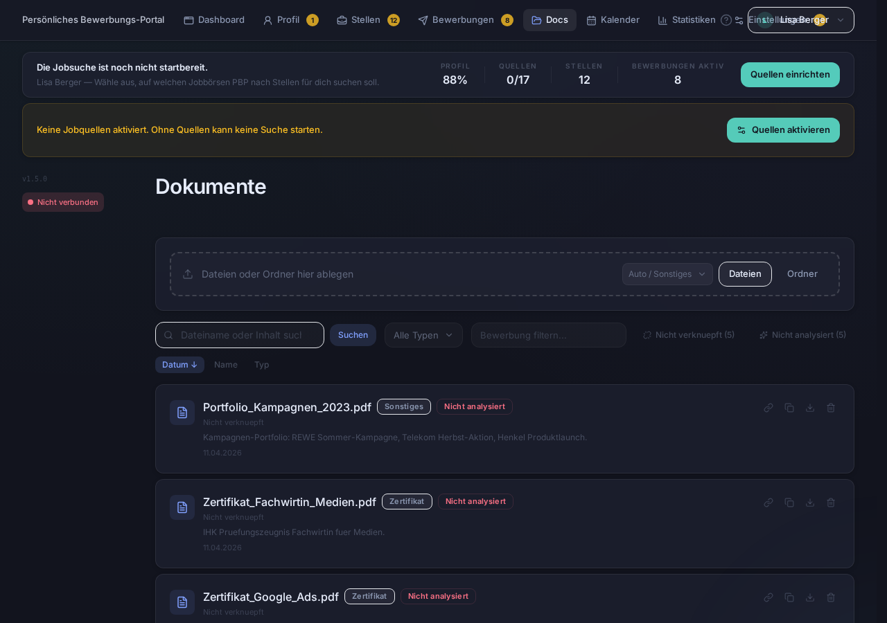
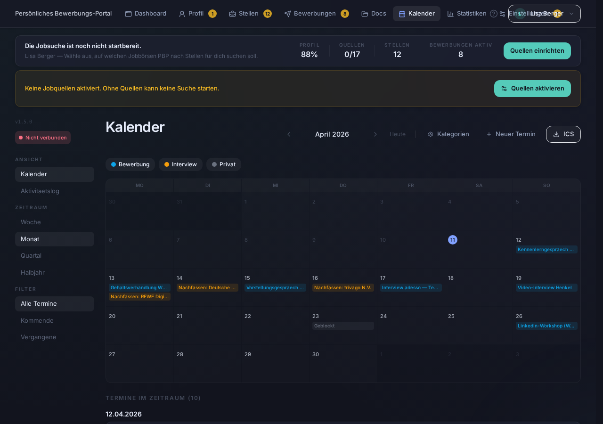
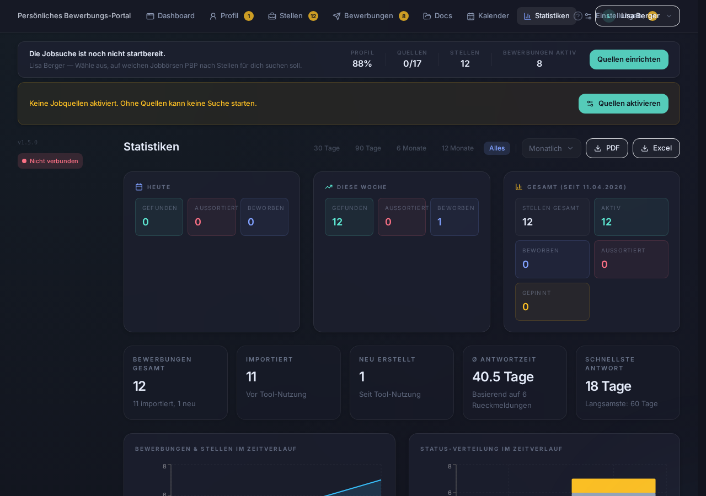
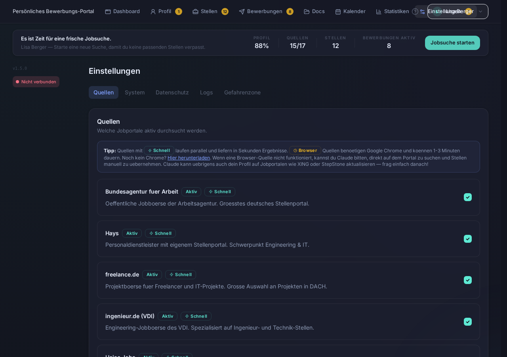

#  PBP — Persönliches Bewerbungs-Portal

<sup>An <b>ELWOSA</b> Project</sup>

> PBP verwaltet deine Bewerbungen, durchsucht diverse Stellenportale und gibt dir ehrliches Feedback zu deinen Unterlagen — mit konkreten Vorschlägen, wie es besser geht. Läuft lokal, kostet nichts, deine Daten bleiben bei dir.

[](https://www.python.org/)
[](https://modelcontextprotocol.io/)
[](LICENSE)
[](https://github.com/MadGapun/PBP/releases/latest)
[](#tests)
[](https://github.com/MadGapun/PBP/wiki/MCP-Tools)
[](https://github.com/MadGapun/PBP/wiki/Workflows)
[](#schnellstart)
[](https://github.com/MadGapun/PBP/wiki)

---

## So funktioniert PBP

**PBP führt dich Schritt für Schritt durch deine Bewerbungen — auch wenn du lange keine geschrieben hast.**

| Schritt | Was passiert |
|---------|-------------|
| **1. Du erzählst kurz von dir** | Claude führt dich durch ein Kennenlerngespräch und baut dein Profil auf. Du musst nichts vorbereiten. |
| **2. PBP findet passende Stellen** | Jobbörsen werden automatisch durchsucht. Du bekommst eine bewertete Liste. |
| **3. Du bewirbst dich — mit Unterstützung** | Anschreiben, Lebenslauf, Interview-Vorbereitung — PBP begleitet dich bei jedem Schritt. |

> 💡 **Wichtig:** PBP arbeitet zusammen mit [Claude Desktop](https://claude.ai/download). Du wirst an bestimmten Stellen automatisch dorthin weitergeleitet — das ist Teil des Ablaufs. Claude ist dein Gesprächspartner, das Dashboard deine Übersicht.

---

## Warum PBP?

Mal ehrlich: Weißt du, wie dein Lebenslauf auf einen Recruiter wirkt? Auf ein ATS-System? Auf einen Personalberater?

Die meisten Bewerber wissen es nicht. Sie schreiben ihren CV einmal, kopieren das Anschreiben mit minimalen Änderungen und wundern sich über Absagen. Nicht weil sie schlecht sind — sondern weil niemand ihnen ehrlich sagt, was sie besser machen könnten.

**PBP ist dieser ehrliche Sparringspartner.**

### Was PBP anders macht

PBP ist kein Tool, das alles für dich erledigt und du drückst nur auf "Absenden". PBP gibt dir **Perspektive, Struktur und ehrliches Feedback** — die Entscheidungen triffst du.

| Du fragst dich... | PBP hilft dir so |
|-------------------|-----------------|
| *"Ist mein Lebenslauf gut genug?"* | **3-Perspektiven-Analyse** — Wie wirkt dein CV auf einen Personalberater, ein ATS-System und einen Recruiter? |
| *"Passe ich überhaupt auf die Stelle?"* | **Fit-Analyse** — Punkt-für-Punkt-Vergleich Profil vs. Stelle. Ehrlich, nicht schöngerechnet. |
| *"Was fehlt mir noch?"* | **Skill-Gap-Analyse** — Welche Fähigkeiten verlangt die Stelle, die du (noch) nicht hast? |
| *"Was soll ich im Interview sagen?"* | **Interview-Simulation** — Claude spielt den Interviewer auf Basis der echten Stelle. |
| *"Wie verhandle ich das Gehalt?"* | **Gehaltsverhandlung** — Markdaten, Strategie, konkrete Argumente. |

### Und wenn du mehr willst

- **18 Jobportale gleichzeitig durchsuchen** — StepStone, Indeed, Hays, Bundesagentur und 14 weitere
- **Angepasste Lebensläufe** — Für jede Stelle ein CV, in dem Skills nach Relevanz sortiert sind
- **E-Mail-Import** — Drag & Drop deine Firmen-Mails rein. Status und Termine werden automatisch erkannt
- **Kalender** — Grafisches Grid mit Kategorien, Kollisionserkennung und .ics-Export
- **Bewerbungs-Tracking** — Pipeline mit Timeline, Notizen, Follow-ups und Statistiken
- **Scoring-Regler** — Konfiguriere, was dir wichtig ist. PBP sortiert automatisch

> 📖 **Alle Features im Detail:** [Wiki → Dashboard](https://github.com/MadGapun/PBP/wiki/Dashboard) · [Workflows](https://github.com/MadGapun/PBP/wiki/Workflows) · [MCP-Tools](https://github.com/MadGapun/PBP/wiki/MCP-Tools) · [Jobportale](https://github.com/MadGapun/PBP/wiki/Jobportale)

### Einfach reden — keine Befehle nötig

Du musst keine Kommandos kennen. **Du redest einfach mit Claude, wie mit einem Menschen.**

> *"Schau mal über meinen Lebenslauf"*
> *"Ich hab ne Absage bekommen, was mach ich falsch?"*
> *"Bereite mich auf das Interview morgen vor"*
> *"Suche was mit Python in Hamburg"*

**🎙️ Oder einfach sprechen:** Drück aufs Mikrofon in Claude Desktop und rede. Interview-Training, Profilerstellung, Feedback — alles geht auch per Sprache.

---

## Voraussetzungen

PBP läuft über [Claude Desktop](https://claude.ai/download) — die kostenlose App von Anthropic für Windows, Mac und Linux.

| | **Free** | **Pro** ⭐ empfohlen | **Max** |
|---|----------|---------------------|---------|
| **Preis** | $0 | **$20/Monat** | $100–200/Monat |
| **Was geht mit PBP** | Reinschnuppern, CV analysieren lassen, einzelne Fragen stellen | **Alles.** Tägliche Nutzung: Jobsuche, Bewerbungen, Interview-Training, Coaching | Für Power-User mit stundenlangen Sessions |
| **Nachrichten** | ~20 pro Tag | ~45 pro 5 Stunden (5× mehr) | 5×–20× mehr als Pro |
| **MCP-Tools (PBP)** | ✅ Funktioniert | ✅ Funktioniert | ✅ Funktioniert |
| **Mikrofon/Sprache** | ✅ Ja | ✅ Ja | ✅ Ja |

> **Vorab, ganz offen:** Wir — die Macher von PBP — haben keinen Vertrag, keine Kooperation und keinen Verdienst durch Anthropic (die Firma hinter Claude). Wir verdienen nichts an diesem Tool. PBP ist ein Herzensprojekt, Open Source, kostenlos.
>
> Trotzdem wollen wir ehrlich sein: Die KI dahinter (Claude) ist ein Service von Anthropic, und der hat Grenzen.
>
> Stell dir PBP vor wie ein Auto mit eingebautem Navi, das du geschenkt bekommst. **Fahren kannst du sofort** — kostenlos. Alles funktioniert, keine Begrenzung von unserer Seite. Aber nach ein paar Kilometern musst du an die Tankstelle, warten bis der Tank wieder voll ist, und dann weiterfahren. So funktioniert der Free-Plan: Du kommst vorwärts, aber in Etappen. Claude wird fürs Denken bezahlt — nicht von uns, sondern von Anthropic.
>
> **Mit Claude Pro ($20/Monat) tankst du voll** — und fährst den ganzen Tag ohne Pause. Jobsuche, Bewerbungen schreiben, Interview-Training, Coaching — alles in einer Session, so viel du willst.
>
> Zum Vergleich: Ein einziger professioneller Bewerbungscheck kostet oft 50–150 €. Mit PBP + Claude Pro hast du einen persönlichen Bewerbungs-Coach für 20 Dollar im Monat — so oft du willst, so lange du willst.
>
> **Unser Rat:** Fang kostenlos an. Installieren, Lebenslauf hochladen, analysieren lassen. Wenn du merkst, dass es dir was bringt — und das wirst du — dann lohnt sich der Volltank.

### Das Besondere

- **Einfach reden — oder sprechen.** Kein Formular, keine Befehle. Tippen oder Mikrofon drücken — Claude versteht beides.

> **&#9888;&#65039; Deine Daten bleiben auf deinem Rechner.** PBP speichert alles in einer einzigen lokalen Datenbankdatei auf deiner Festplatte (`pbp.db`). **Kein Server, kein Account, kein Cloud-Speicher.** Wenn du die Datei löschst, ist alles weg. Wenn du sie kopierst, hast du ein komplettes Backup. So einfach. **Deine Bewerbungsdaten verlassen niemals deinen Computer.**

- **Festanstellung & Freelance.** Egal ob fester Job oder Projektaufträge — PBP unterstützt beides.
- **Multi-Profil.** Mehrere Benutzer auf einem Rechner? Kein Problem — jedes Profil hat eigene Daten.
- **Open Source & kostenlos.** PBP selbst kostet nichts. Du brauchst nur Claude Desktop (Free oder Pro).

---

## Schnellstart

### Windows (Empfohlen)

1. **Lade die [neueste Version](https://github.com/MadGapun/PBP/releases/latest) herunter** (ZIP-Datei)
2. **Entpacke** das ZIP in einen Ordner (z.B. `C:\PBP`)
3. **Doppelklicke `INSTALLIEREN.bat`** — fertig!

> **Voraussetzungen:** Windows 10/11 (64-Bit), Internetverbindung, [Claude Desktop](https://claude.ai/download)

### macOS

1. **Lade die [neueste Version](https://github.com/MadGapun/PBP/releases/latest) herunter** (ZIP-Datei)
2. **Entpacke** das ZIP
3. **Doppelklicke `INSTALLIEREN.command`** — fertig!

> **Voraussetzungen:** macOS 12+, Python 3.11+ (`brew install python@3.12`), [Claude Desktop](https://claude.ai/download)

### Linux

```bash
git clone https://github.com/MadGapun/PBP.git && cd PBP && bash installer/install.sh
```

> 📖 **Detaillierte Anleitungen, Claude Desktop Config und Fehlerbehebung:** [Wiki → Installation](https://github.com/MadGapun/PBP/wiki/Installation)

### Erste Schritte

Öffne Claude Desktop und sage:

> **"Starte die Ersterfassung"**

Claude führt dich durch ein lockeres Gespräch (ca. 10-15 Minuten) und baut dein Profil auf.
**Schneller geht's mit Dokumenten:** Lade deinen Lebenslauf als PDF oder DOCX hoch — PBP extrahiert die Daten automatisch.

> 📖 **Schritt-für-Schritt-Anleitung:** [Wiki → Erste Schritte](https://github.com/MadGapun/PBP/wiki/Erste-Schritte)

---

## Screenshots

> UI-Design von [@Koala280](https://github.com/Koala280) — React 19 + Vite + Tailwind CSS

### Erster Start — So begruesst dich PBP


### Profil unvollstaendig — PBP zeigt dir den naechsten Schritt


### Alles eingerichtet — Dashboard im Normalbetrieb


### Dashboard — "Im Fluss", Termine und Schnellimport


### Profil — Berufserfahrung, Skills, Ausbildung


### Stellen — Scoring, Filter und Fit-Analyse


### Bewerbungen — Pipeline mit Follow-ups und Dossier


### Dokumente — Upload, Verknuepfung und Analyse


### Kalender — Grafisches Grid mit Kategorien


### Statistiken — Charts mit flexiblen Zeitraeumen


### Einstellungen — Quellen, Export & Backup, Datenschutz


---

## Auf einen Blick

| | |
|---|---|
| **Plattformen** | Windows, macOS, Linux |
| **MCP-Tools** | 73 Tools in 8 Modulen |
| **Workflows** | 18 gefuehrte Workflows |
| **Jobportale** | 18 Quellen (11 schnell, 4 Browser, 3 manuell) |
| **Dashboard** | 8 Tabs: Dashboard, Profil, Stellen, Bewerbungen, Dokumente, Kalender, Statistiken, Einstellungen |
| **Datenbank** | SQLite, 29 Tabellen, Schema v23 |
| **Tests** | 401 bestanden |

> 📖 **Technische Details:** [Wiki → Architektur](https://github.com/MadGapun/PBP/wiki/Architektur) · [MCP-Tools](https://github.com/MadGapun/PBP/wiki/MCP-Tools) · [Jobportale](https://github.com/MadGapun/PBP/wiki/Jobportale)

---

## Changelog

> Vollstaendiges Changelog: [CHANGELOG.md](CHANGELOG.md)

### v1.5.0 — Kalender, macOS, E-Mail-Pipeline, Dashboard-Redesign (2026-04-10)

Das groesste Update seit dem ersten Public Release:

- **macOS offiziell unterstuetzt** — Doppelklick-Installer, Dashboard-Starter, Deinstaller
- **Kalender-System** — Grafisches Grid, CRUD, benutzerdefinierte Kategorien, .ics-Export, Kollisionserkennung
- **E-Mail-Pipeline** — Import (.msg/.eml), automatische Zuordnung, Status-Erkennung, Termin-Extraktion
- **Dashboard-Redesign** — "Im Fluss" + Schnellimport, Follow-ups ueber Bewerbungen
- **Export & Backup zentralisiert** — Komplett-Export, DB-Backup und Profil-Import in den Einstellungen
- Schema v23, 73 Tools, 18 Prompts, 401 Tests

### v1.0.0 — Erster Public Release (2026-03-26)
- 72 Tools, 16 Prompts, 18 Quellen, React 19 Dashboard
- E-Mail-Integration, Multi-Profil, Scoring-Regler, Geocoding, CV-Export

---

## FAQ

**Brauche ich ueberhaupt eine KI?**
Nein! PBP ist ein eigenstaendiges Verwaltungstool. Ohne Claude kannst du: Bewerbungen verwalten, Dokumente organisieren, Termine planen, Statistiken auswerten, E-Mails importieren und Follow-ups tracken. Claude ist ein optionaler Sparringspartner — er kann dir Feedback geben, Anschreiben formulieren oder Interviews simulieren. Aber die Kernfunktionen laufen komplett ohne KI.

**Brauche ich einen Claude Pro Account?**
Nein — PBP funktioniert mit jedem Claude Desktop Account, auch dem kostenlosen. Ein Pro-Account hat hoehere Nutzungslimits, was bei vielen Jobsuchen hilfreich sein kann.

**Werden meine Daten in die Cloud geschickt?**
Deine Profildaten, Bewerbungen und Dokumente bleiben lokal auf deinem Rechner (SQLite). Wenn du Claude nutzt (Gespraech, Anschreiben, Fit-Analyse), werden die relevanten Daten an Claude gesendet — wie bei jeder normalen Claude-Konversation.

**Kann ich PBP ohne Jobportale nutzen?**
Ja! Du kannst PBP auch nur fuer Profilerstellung, Lebenslauf-Export und Bewerbungstracking nutzen, ganz ohne Stellensuche.

> 📖 **Weitere Fragen und Troubleshooting:** [Wiki → FAQ](https://github.com/MadGapun/PBP/wiki/FAQ)

---

## Lizenz

[MIT License](LICENSE) — Markus Birzite

---

## Credits

**Markus Birzite** — Idee, Konzept, Architektur & Projektleitung
> Hat PBP erdacht, die Vision definiert und das Projekt von Anfang an geleitet. Treibt Richtung, Priorisierung und Qualität.

**Claude** (Anthropic) — Entwicklung, Code, Dokumentation, Tests
> Hauptentwickler seit v0.1.0. Hat den Großteil des Codes geschrieben — Backend, Frontend-Integration, Scraper, Tests, Installer, Dashboard, E-Mail-Service. Jeder Commit trägt seinen Namen. Intern: "der Onkel".

**ChatGPT** (OpenAI) — Bewertung, Analyse & Qualitätssicherung
> Die neutrale Instanz im Team. Bewertet Ergebnisse von Claude und Codex, liest jede Analyse quer, hinterfragt Annahmen und stellt sicher, dass nichts schöngeredet wird. Intern: "die Mama".

**Codex** (OpenAI) — Code-Analyse, Recovery & Bugfixes
> Kommt ins Spiel wenn größere Code-Analysen, Refactorings oder Recovery-Aufgaben anstehen. Hat u.a. das Frontend-Recovery (v0.25.2) durchgeführt und liefert zuverlässig Fixes für komplexe Bugs. Intern: "die Tante".

**Toms ([@Koala280](https://github.com/Koala280))** — React-Frontend, Testing & Sparringspartner
> Hat das React 19 + Vite + Tailwind Frontend beigesteuert (v0.23.0, 7.877 Zeilen), das System ausgiebig getestet und als Diskussionspartner die UX mitgeformt. AI & Data Science Student.

**ELWOSA** — Fundament, Projektmanagement & Dateninfrastruktur
> Die allererste PBP-Version lief direkt auf der ELWOSA-Datenbank — dort wurde der Prototyp entwickelt und erprobt, bevor er zur eigenständigen Anwendung umgebaut wurde. ELWOSA liefert bis heute Projektmanagement, Server-Infrastruktur, CI/CD-Prozesse und Entwicklungsmethodik.

---

<p align="center">
<a href="https://paypal.me/birzite"></a>
<br><sub>An <b>ELWOSA</b> Project</sub>
</p>
