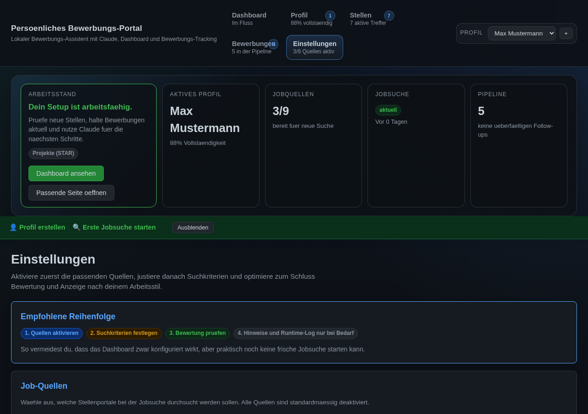

# PBP — Persönliches Bewerbungs-Portal

> Dein KI-gestützter Bewerbungsassistent für Claude Desktop — von der Profilerstellung bis zum Traumjob.

[](https://www.python.org/)
[](https://modelcontextprotocol.io/)
[](LICENSE)
[](#tests)
[](#mcp-schnittstelle)
[](#die-14-workflows)

---

## Warum PBP?

Jobsuche ist zeitfressend. Du schreibst Lebensläufe um, googelst Stellenbörsen, copy-pastest zwischen Tabs, verlierst den Überblick über Bewerbungen und fragst dich, ob du die richtige Stelle überhaupt findest.

**PBP nimmt dir das ab.** Du redest einfach mit Claude — in natürlicher Sprache — und PBP erledigt den Rest:

| Problem | PBP-Lösung |
|---------|-----------|
| 😩 Lebenslauf für jede Stelle umschreiben | ✅ **Angepasster Lebenslauf** — PBP erstellt für jede Stelle einen maßgeschneiderten CV (DOCX), sortiert Skills und Erfahrung nach Relevanz, bewertet aus 3 Perspektiven (Personalberater, ATS, Recruiter) |
| 😩 10 Jobportale einzeln durchsuchen | ✅ **17 Portale gleichzeitig** — eine Suche, alle Ergebnisse: StepStone, LinkedIn, Indeed, Hays, XING, Monster, Bundesagentur, Freelancermap, Freelance.de, GULP, SOLCOM, Jobware, FERCHAU, ingenieur.de, Heise Jobs, Stellenanzeigen.de, Kimeta |
| 😩 Hunderte Stellen manuell durchlesen | ✅ **Intelligentes Scoring** — Stellen werden automatisch nach deinem Profil bewertet und sortiert (Entfernung, Skills, Gehalt). Duplikate werden portalübergreifend erkannt. |
| 😩 Anschreiben von Null anfangen | ✅ **Personalisierte Anschreiben** — basierend auf deinem Profil und der Stellenbeschreibung (PDF, DOCX, Markdown oder TXT) |
| 😩 Überblick über Bewerbungen verlieren | ✅ **Bewerbungs-Tracking** — Pipeline von "offen" bis "Angebot" mit Timeline, Notizen, Bearbeitung und Statistiken |
| 😩 Interviewvorbereitung improvisieren | ✅ **Interview-Simulation** — Claude spielt den Interviewer und gibt Feedback |
| 😩 Gehalt falsch verhandeln | ✅ **Gehaltsverhandlung** — Markdaten-basierte Strategie und Argumentationshilfe |
| 😩 Absage bekommen und ratlos sein | ✅ **Ablehnungs-Coaching** — Empathische Analyse mit konkreten Verbesserungsvorschlägen |

### Das Besondere

- **Kein Formular-Ausfüllen.** Du unterhältst dich mit Claude. PBP baut dein Profil aus dem Gespräch auf.
- **Deine Daten bleiben lokal.** SQLite auf deinem Rechner — nichts geht in die Cloud (außer an Claude für die KI-Verarbeitung).
- **Festanstellung & Freelance.** Egal ob du einen festen Job oder Projektaufträge suchst — PBP unterstützt beides mit getrennter Darstellung.
- **STAR-Methode für Projekte.** PBP strukturiert deine Berufserfahrung nach Situation-Task-Action-Result — das Format, das Recruiter lieben.

---

## Was PBP kann — Feature-Übersicht

### 🗣️ Profilerstellung im Gespräch
Claude führt ein lockeres Interview und erfasst alles:
- Persönliche Daten, Kontakt, Standort
- Berufserfahrung mit Projekten (STAR-Methode)
- Ausbildung, Zertifikate, Sprachen
- Skills mit Level (1-5) und Aktualität
- Gehaltsvorstellungen und Arbeitspräferenzen (Remote, Teilzeit, Reisebereitschaft)

**Oder:** Lade einfach deinen bestehenden Lebenslauf hoch (PDF/DOCX) — PBP extrahiert die Daten automatisch.

### 🔍 Stellensuche über 17 Portale
Eine Suche — alle relevanten Portale gleichzeitig:

**Festanstellung (11 Quellen):**

| Portal | Methode | Account nötig? |
|--------|---------|---------------|
| Bundesagentur für Arbeit | REST API | ❌ Nein |
| StepStone | Playwright | ❌ Nein |
| Hays | Sitemap + JSON-LD | ❌ Nein |
| Monster | Playwright | ❌ Nein |
| Indeed | Playwright | ❌ Nein |
| ingenieur.de (VDI) | HTML Scraping | ❌ Nein |
| Heise Jobs | HTML + JSON-LD | ❌ Nein |
| Stellenanzeigen.de | HTML + JSON-LD | ❌ Nein |
| Jobware | HTML + JSON-LD | ❌ Nein |
| FERCHAU | HTML + JSON-LD | ❌ Nein |
| Kimeta (Aggregator) | HTML Scraping | ❌ Nein |

**Freelance & Projekte (4 Quellen):**

| Portal | Methode | Account nötig? |
|--------|---------|---------------|
| Freelancermap | httpx + Fallback | ❌ Nein |
| Freelance.de | HTML Scraping | ❌ Nein |
| GULP | HTML + JSON-LD | ❌ Nein |
| SOLCOM | HTML + JSON-LD | ❌ Nein |

**Netzwerk-Portale (2 Quellen — optionaler Login):**

| Portal | Methode | Account nötig? |
|--------|---------|---------------|
| **LinkedIn** | **Playwright** | **✅ Ja — eigener Account** |
| **XING** | **Playwright** | **✅ Ja — eigener Account** |

> 💡 Du kannst in den Einstellungen frei wählen, welche Quellen aktiv sein sollen. 15 der 17 Quellen funktionieren ohne Login.

### 📊 Intelligentes Scoring & Fit-Analyse
Jede Stelle bekommt einen Score basierend auf:
- **Entfernung** — 30/50/100/200km-Stufen, Stellen unter 30 km bevorzugt
- **Keywords** — MUSS/PLUS/AUSSCHLUSS-Kriterien
- **Gehalt** — Vergleich mit deiner Gehaltsvorstellung (Tagessatz ↔ Jahresgehalt automatisch normalisiert)
- **Remote-Level** — Remote/Hybrid-Differenzierung mit Bonus
- **Kompetenzen-Match** — Deine Skills vs. Stellenbeschreibung
- **Bewerbungs-Signal** — Stellen ähnlich zu bisherigen Bewerbungen werden automatisch höher bewertet
- **Duplikat-Erkennung** — Gleiche Stelle auf mehreren Portalen wird erkannt und zusammengeführt

Im Dashboard werden Stellen nach Typ getrennt dargestellt:
- **Linke Spalte:** Festanstellung
- **Rechte Spalte:** Freelance/Projekt
- Umschaltbar auf Listen-Ansicht per Knopfdruck
- Paginierung mit frei wählbarer Seitengröße

### 📝 Stellenspezifische Dokumente
- **Angepasster Lebenslauf (DOCX)** — Skills und Positionen werden nach Relevanz für die Stelle umsortiert
- **Personalisiertes Anschreiben (PDF/DOCX/MD/TXT)** — basierend auf Profil + Stellenbeschreibung
- **Standard-Lebenslauf (PDF/DOCX/MD/TXT)** — für Initiativbewerbungen, jetzt auch als Markdown oder Klartext
- **3-Perspektiven-Analyse** — Wie wirkt dein CV auf einen Personalberater, ein ATS-System und einen HR-Recruiter? Mit einstellbarer Gewichtung und konkreten Verbesserungsvorschlägen.

> 📌 Immer DOCX beim angepassten CV — weil die letzten Feinschliffe ein Mensch machen sollte.

### 📈 Bewerbungs-Tracking & Detailansicht
- Status-Pipeline: offen → beworben → Interview → Angebot → angenommen/abgelehnt/abgelaufen
- **Detailansicht pro Bewerbung** — Klick zeigt alles auf einen Blick:
  - Stellenbeschreibung (aufklappbar), Fit-Score, Quelle, Gehalt, Standort, Remote-Level
  - Kontaktdaten (Ansprechpartner + E-Mail)
  - Verknüpfte Dokumente (Lebenslauf, Anschreiben, Zeugnisse)
  - Chronologischer Verlauf mit Zeitstempeln
- **Gesprächsnotizen** — Telefonnotizen, Interview-Feedback, Vorbereitung direkt zur Bewerbung
  - Hinzufügen, Bearbeiten, Löschen mit Zeitstempeln
  - Visuell getrennt von Statusänderungen
- **Dokumente verknüpfen** — Unterlagen direkt aus der Detailansicht zuordnen
- **Archiv** — Abgelehnte/zurückgezogene/abgelaufene Bewerbungen in eingeklappter Sektion
- Conversion-Rates und **Statistik-Dashboard** (5 Charts: Timeline, Status-Donut, Quellen, Score-Verteilung)
- Follow-up-Erinnerungen (automatisch geplant)
- A/B-Tracking für Anschreiben-Stile
- Ablehnungs-Muster-Analyse mit lernenden Ablehnungsgründen
- **PDF-Bewerbungsbericht** (Arbeitsamt-tauglich) + Excel-Export

### 🎯 KI-Coaching
- **Interview-Simulation** — Claude spielt den Interviewer (auf Basis der echten Stelle)
- **Gehaltsverhandlung** — Markdaten, Strategie, Argumente
- **Ablehnungs-Coaching** — Empathische Analyse nach Absage mit konkreten Verbesserungsvorschlägen
- **Auto-Bewerbung** — Komplette Bewerbung aus URL oder Stellentext (Fit-Analyse → CV → Anschreiben → Tracking)
- **Antwort-Formulierung** — Kontext für Recruiter-Antworten basierend auf Bewerbungshistorie
- **Skill-Gap-Analyse** — Was dir für die Wunschstelle fehlt
- **Profil-Analyse** — Stärken, Potenziale, Marktposition
- **Netzwerk-Strategie** — Networking-Plan für eine Zielfirma
- **Branchen-Trends** — Welche Skills gerade gefragt sind

### 🌐 Web-Dashboard
Browser-Oberfläche auf `localhost:8200` mit 6 Tabs:

| Tab | Funktion |
|-----|----------|
| **Dashboard** | Übersicht, Workspace-Guidance, nächste Schritte, Statistik-Vorschau |
| **Profil** | Alles bearbeiten — Positionen, Skills, Ausbildung, Projekte. Drag & Drop Upload. Multi-Profil-Wechsler. |
| **Stellen** | Jobs mit Fit-Score, Split-View (Fest/Freelance), Sortierung, Paginierung, Quellen-Badges, Pin/Unpin |
| **Bewerbungen** | Pipeline, Detailansicht mit Stelleninfos + Dokumenten + Gesprächsnotizen, Archiv-Sektion |
| **Statistiken** | 5 interaktive Charts: Bewerbungs-Timeline, Status-Donut, Quellen-Vergleich, Score-Verteilung, Quellen-Scores |
| **Einstellungen** | Quellen, Suchkriterien, Blacklist, Gehaltsfilter |

---

## Schnellstart

### 1. Installation (Windows)

1. **Lade die [neueste Version](https://github.com/MadGapun/PBP/releases/latest) herunter** (ZIP-Datei)
2. **Entpacke** das ZIP in einen Ordner (z.B. `C:\PBP`)
3. **Doppelklicke `INSTALLIEREN.bat`** — fertig!

Der Installer:
- Lädt Python herunter und richtet es ein
- Installiert alle Pakete
- Konfiguriert Claude Desktop automatisch
- Erstellt eine Desktop-Verknüpfung

> **Voraussetzungen:** Windows 10/11 (64-Bit), Internetverbindung, [Claude Desktop](https://claude.ai/download)

### 2. Profil erstellen

Öffne Claude Desktop und sage:

> **"Starte die Ersterfassung"**

Claude führt dich durch ein lockeres Gespräch (ca. 10-15 Minuten):

1. **Persönliche Daten** — Name, Kontakt, Standort
2. **Berufserfahrung** — Positionen und Projekte (STAR-Methode)
3. **Ausbildung & Skills** — mit Levels und Aktualität
4. **Präferenzen** — Gehalt, Remote, Teilzeit, Reisebereitschaft

**Schneller geht's mit Dokumenten:** Lade deinen Lebenslauf als PDF oder DOCX hoch — PBP extrahiert die Daten automatisch und fragt nur noch nach, was fehlt.

### 3. Suchkriterien festlegen

> **"Starte den Jobsuche-Workflow"**

Claude hilft dir bei:
- MUSS-Keywords (z.B. "PLM", "Python")
- PLUS-Keywords (z.B. "Remote", "Teamleitung")
- AUSSCHLUSS-Keywords (z.B. "SAP", "Zeitarbeit")
- Standort und Entfernungsradius
- Gehaltsvorstellungen
- Aktive Jobportale auswählen

### 4. Jobs finden

> **"Suche nach Stellen"**

PBP durchsucht alle aktiven Portale, dedupliziert die Ergebnisse und bewertet jede Stelle. Im Dashboard siehst du die Ergebnisse sofort — sortiert nach Entfernung, Score oder Gehalt.

### 5. Bewerben

> **"Schreibe eine Bewerbung für die Stelle bei [Firma]"**

PBP erstellt:
1. Einen **angepassten Lebenslauf** (Skills und Erfahrung nach Relevanz sortiert)
2. Ein **personalisiertes Anschreiben** (optional — manchmal reicht der CV)

Beide Dokumente als DOCX zum Feinschliff.

### 6. Nachverfolgen

> **"Zeige meine Bewerbungen"**

Behalte den Überblick: Status aktualisieren, Follow-ups planen, Statistiken auswerten.

---

## Bedienungsanleitung

### Wie spreche ich mit PBP?

PBP wird komplett über natürliche Sprache gesteuert. Du tippst (oder sagst) Claude einfach, was du willst:

| Was du sagen kannst | Was PBP tut |
|--------------------|------------|
| "Starte die Ersterfassung" | Profilerstellung im Gespräch |
| "Lade meinen Lebenslauf" | Dokument-Upload und automatische Extraktion |
| "Suche nach Python-Entwickler-Stellen in Hamburg" | Multi-Portal-Jobsuche |
| "Zeige mir die besten Stellen" | Stellen nach Score sortiert |
| "Mach eine Fit-Analyse für Stelle #3" | Detaillierter Vergleich Profil vs. Stelle |
| "Schreibe ein Anschreiben für die Hays-Stelle" | Personalisiertes Anschreiben |
| "Erstelle einen angepassten Lebenslauf für Firma XY" | Stellenspezifischer CV |
| "Exportiere meinen Lebenslauf als DOCX" | Standard-CV-Export |
| "Bereite mich auf das Interview bei Firma XY vor" | Interview-Simulation |
| "Wie sollte ich beim Gehalt verhandeln?" | Gehaltsverhandlungs-Coaching |
| "Bewerte meinen Lebenslauf für die Stelle bei Firma XY" | 3-Perspektiven-Analyse (Personalberater, ATS, Recruiter) |
| "Welche Skills fehlen mir für die Stelle?" | Skill-Gap-Analyse |
| "Zeige meine Bewerbungsstatistiken" | Conversion-Rates und Übersicht |
| "Plane einen Follow-up für die Bewerbung bei Firma XY" | Erinnerung in X Tagen |

### Die 14 Workflows

PBP bietet 14 geführte Workflows. Du kannst sie entweder als Slash-Command (`/name`) oder als natürliche Anweisung starten:

| Workflow | Slash-Command | Was er tut |
|----------|--------------|-----------|
| **Ersterfassung** | `/ersterfassung` | Komplettes Profil im Gespräch aufbauen |
| **Profil-Erweiterung** | `/profil_erweiterung` | Profil aus Dokumenten erweitern |
| **Profil überprüfen** | `/profil_ueberpruefen` | Fehler und Lücken finden |
| **Profil-Analyse** | `/profil_analyse` | Stärken, Potenziale, Marktposition |
| **Jobsuche** | `/jobsuche_workflow` | Geführte 5-Schritte Stellensuche |
| **Bewerbung schreiben** | `/bewerbung_schreiben` | CV + Anschreiben für eine Stelle |
| **Auto-Bewerbung** | `/auto_bewerbung` | Komplette Bewerbung aus URL/Stellentext |
| **Bewerbungsübersicht** | `/bewerbungs_uebersicht` | Komplettübersicht aller Aktivitäten |
| **Ablehnungs-Coaching** | `/ablehnungs_coaching` | Empathische Analyse nach Absage |
| **Interview-Vorbereitung** | `/interview_vorbereitung` | STAR-Antworten vorbereiten |
| **Interview-Simulation** | `/interview_simulation` | Claude spielt den Interviewer |
| **Gehaltsverhandlung** | `/gehaltsverhandlung` | Strategie und Argumente |
| **Netzwerk-Strategie** | `/netzwerk_strategie` | Networking-Plan für Zielfirma |
| **Willkommen** | `/willkommen` | Statusübersicht und Einstiegshilfe |

> 💡 **Tipp:** In **claude.ai** (Web) gibt es keine Slash-Commands. Sage einfach: *"Starte den Workflow: /jobsuche_workflow"* — PBP erkennt das automatisch.

### Das Web-Dashboard

Das Dashboard startet automatisch auf [http://localhost:8200](http://localhost:8200) wenn PBP läuft.

**Dashboard-Tab:**
- Workspace-Guidance zeigt dir den nächsten sinnvollen Schritt
- Next-Steps-Banner mit kontextbezogenen Aktionen
- Statistiken auf einen Blick

**Profil-Tab:**
- Alle Daten bearbeiten (Klick auf ✏️)
- Skills mit Level und Kategorie
- Projekte im STAR-Format
- Jobtitel-Vorschläge

**Stellen-Tab:**
- Split-View: Festanstellung links, Freelance rechts (umschaltbar)
- Sortierung: Entfernung (Standard), Score, Gehalt, Datum
- Fit-Analyse per Klick
- Bewerbungs-Wizard direkt aus der Stellenanzeige

**Bewerbungen-Tab:**
- Pipeline-Ansicht mit Status-Filter und Paginierung (30er Seiten)
- **Detailansicht** (Klick auf Bewerbung): Stellendetails, Fit-Score, Quelle, Gehalt, Kontakt, Stellenbeschreibung, verknüpfte Dokumente, Gesprächsnotizen, Timeline
- **Gesprächsnotizen**: Hinzufügen, Bearbeiten, Löschen — mit Zeitstempeln
- **Dokument-Verknüpfung**: Unterlagen direkt zuordnen
- **Archiv**: Abgelehnte/zurückgezogene/abgelaufene Bewerbungen eingeklappt
- Follow-up-Erinnerungen
- PDF-Bewerbungsbericht + Excel-Export

**Statistiken-Tab:**
- 5 interaktive Charts (Chart.js): Bewerbungs-Timeline, Status-Donut, Quellen-Vergleich, Fit-Score-Verteilung, Quellen-Detailvergleich
- Umschaltbar: Woche / Monat / Quartal / Jahr

**Einstellungen-Tab:**
- Aktive Jobportale auswählen
- MUSS/PLUS/AUSSCHLUSS-Keywords
- Firmen-Blacklist
- Gehaltsfilter

### Multi-Profil

Mehrere Benutzer auf einem PC? Kein Problem:

> **"Zeige alle Profile"** — Profile auflisten
> **"Wechsle zu Profil XY"** — Aktives Profil wechseln
> **"Erstelle ein neues Profil für Anna"** — Neues Profil anlegen

Im Dashboard steht der Profil-Wechsler direkt in der Navigationsleiste.

---

## Jobportale — Accounts und rechtliche Hinweise

### Welche Portale brauchen einen Account?

| Portal | Account nötig? | Details |
|--------|---------------|---------|
| Bundesagentur | Nein | Öffentliche REST API |
| StepStone | Nein | Öffentlich einsehbare Stellenanzeigen |
| Hays | Nein | Öffentliche Sitemap + strukturierte Daten |
| Monster | Nein | Öffentlich einsehbare Stellenanzeigen |
| Indeed | Nein | Öffentlich einsehbare Stellenanzeigen |
| Freelancermap | Nein | Öffentlich einsehbare Projektlisten |
| Freelance.de | Nein | Öffentlich einsehbare Projektlisten |
| GULP | Nein | Öffentlich einsehbare Projektlisten |
| SOLCOM | Nein | Öffentlich einsehbares Projektportal |
| ingenieur.de (VDI) | Nein | Öffentliche Engineering-Jobbörse |
| Heise Jobs | Nein | Öffentlicher IT-Stellenmarkt |
| Stellenanzeigen.de | Nein | Öffentlich einsehbare Stellenanzeigen |
| Jobware | Nein | Öffentlich einsehbare Stellenanzeigen |
| FERCHAU | Nein | Öffentliche Stellenangebote |
| Kimeta | Nein | Öffentlicher Job-Aggregator |
| **LinkedIn** | **Ja** | Kostenloser Account reicht. Du musst dich **einmalig** im Browser einloggen — PBP speichert die Session lokal. |
| **XING** | **Ja** | Kostenloser Account reicht. Gleicher Ansatz wie LinkedIn — einmaliger Login. |

### LinkedIn und XING einrichten

Beide Portale erfordern einen einmaligen Login:

1. **Aktiviere** LinkedIn/XING in den PBP-Einstellungen (Dashboard → Einstellungen → Quellen)
2. **Starte eine Jobsuche** — PBP erkennt, dass noch kein Login vorliegt
3. **Ein Browser-Fenster öffnet sich** — logge dich ganz normal ein
4. **Session wird gespeichert** — alle weiteren Suchen laufen automatisch (headless)

Die Session wird lokal gespeichert unter:
- LinkedIn: `~/.bewerbungs-assistent/linkedin-session/` (bzw. `%LOCALAPPDATA%\BewerbungsAssistent\linkedin-session\`)
- XING: `~/.bewerbungs-assistent/xing-session/`

> ⚠️ Wenn die Session abläuft (nach Wochen/Monaten), öffnet sich der Browser erneut zum Login.

### Rechtliche Einordnung

PBP ist ein **persönliches Werkzeug**, das in deinem Namen und mit deinen Accounts auf Jobportale zugreift — vergleichbar damit, dass du selbst im Browser suchst.

**Was PBP tut:**
- Durchsucht öffentlich zugängliche Stellenanzeigen
- Greift auf LinkedIn/XING nur mit **deinem persönlichen Account** und **deiner aktiven Session** zu
- Speichert Stellendaten **nur lokal** auf deinem Rechner
- Macht keine Massenanfragen — menschliche Verzögerungen zwischen Anfragen

**Was PBP NICHT tut:**
- Keine Daten anderer Nutzer scrapen (nur Stellenanzeigen)
- Keine Accounts anlegen oder Passwörter speichern
- Keine Daten an Dritte weitergeben
- Kein Umgehen von Zugangsschranken (du bist selbst eingeloggt)

**Deine Verantwortung:**
- Du nutzt PBP mit **deinen eigenen Accounts** und bist für die Einhaltung der jeweiligen Nutzungsbedingungen verantwortlich.
- LinkedIn und XING verbieten in ihren AGB die Nutzung automatisierter Tools. In der Praxis tolerieren die meisten Plattformen persönliche Nutzung mit normaler Frequenz — PBP simuliert menschliches Suchverhalten mit Verzögerungen. Trotzdem besteht theoretisch das Risiko einer Account-Sperre.
- Die Bundesagentur für Arbeit stellt eine **offizielle REST API** bereit, die zur Nutzung vorgesehen ist.
- StepStone, Hays, Monster, Indeed, Freelancermap, Freelance.de, GULP, SOLCOM, ingenieur.de, Heise Jobs, Stellenanzeigen.de, Jobware, FERCHAU und Kimeta werden über öffentlich zugängliche Seiten durchsucht.

> 💡 **Empfehlung:** Wenn du auf Nummer sicher gehen willst, deaktiviere LinkedIn und XING in den Einstellungen und nutze die 15 anderen Quellen. Die liefern bereits eine hervorragende Abdeckung des deutschen Stellenmarkts — Festanstellung, Freelance und Engineering.

---

## Installation im Detail

### Windows (Empfohlen)

1. **Lade die [neueste Version](https://github.com/MadGapun/PBP/releases/latest) herunter** (ZIP-Datei)
2. **Entpacke** das ZIP in einen Ordner deiner Wahl (z.B. `C:\PBP`)
3. **Doppelklicke `INSTALLIEREN.bat`** — der Rest passiert automatisch:
   - Python wird heruntergeladen und eingerichtet
   - Alle Pakete werden installiert
   - Claude Desktop wird konfiguriert
   - Eine Desktop-Verknüpfung wird erstellt

> **Voraussetzungen:** Windows 10/11 (64-Bit), Internetverbindung, [Claude Desktop](https://claude.ai/download)

### Linux / Manuell

```bash
# Repository klonen
git clone https://github.com/MadGapun/PBP.git
cd PBP

# Virtual Environment erstellen
python3 -m venv venv
source venv/bin/activate

# Installieren (Kern + Docs)
pip install -e ".[docs]"

# Optional: Scraper mit Playwright
pip install -e ".[all]"
playwright install chromium
```

### Claude Desktop konfigurieren

Die `INSTALLIEREN.bat` macht das automatisch. Für manuelle Konfiguration, füge in `%APPDATA%\Claude\claude_desktop_config.json` hinzu:

```json
{
  "mcpServers": {
    "bewerbungs-assistent": {
      "command": "python",
      "args": ["-m", "bewerbungs_assistent"],
      "env": {
        "BA_DATA_DIR": "C:\\Users\\DEIN_NAME\\AppData\\Local\\BewerbungsAssistent"
      }
    }
  }
}
```

### Nach der Installation

```
%LOCALAPPDATA%\BewerbungsAssistent\
├── python\          ← Embedded Python (vom Installer)
├── src\             ← PBP Source Code (vom Installer)
├── pbp.db           ← Deine Datenbank (Profil, Jobs, Bewerbungen)
├── dokumente\       ← Hochgeladene Dokumente
├── export\          ← Generierte Lebensläufe und Anschreiben
└── logs\            ← Protokolle
```

---

## Architektur

```
Claude Desktop / claude.ai
    │
    │ stdio (MCP Protocol)
    ▼
server.py (FastMCP, Composition Root)
    │
    ├──► tools/            ◄── 62 Tools in 8 Modulen
    ├──► prompts.py        ◄── 14 Prompts (Workflows)
    ├──► resources.py      ◄── 6 Resources
    │
    ├──► services/         ◄── Service-Layer (Profil, Suche, Workspace)
    ├──► database.py       ◄── SQLite (16 Kern-Tabellen, WAL, Schema v10)
    ├──► dashboard.py      ◄── FastAPI :8200, 70+ API-Endpoints
    ├──► export.py         ◄── Lebenslauf + Anschreiben (PDF/DOCX)
    └──► job_scraper/      ◄── 17 Quellen
              ├── bundesagentur.py       (REST API)
              ├── stepstone.py           (Playwright)
              ├── hays.py                (Sitemap + JSON-LD)
              ├── freelancermap.py       (httpx + Playwright Fallback)
              ├── freelance_de.py        (HTML Scraping)
              ├── linkedin.py            (Playwright + Persistent Session)
              ├── indeed.py              (Playwright)
              ├── xing.py                (Playwright + Persistent Session)
              ├── monster.py             (Playwright)
              ├── ingenieur_de.py        (HTML Scraping)
              ├── heise_jobs.py          (HTML + JSON-LD)
              ├── gulp.py                (HTML + JSON-LD)
              ├── solcom.py              (HTML + JSON-LD)
              ├── stellenanzeigen_de.py  (HTML + JSON-LD)
              ├── jobware.py             (HTML + JSON-LD)
              ├── ferchau.py             (HTML + JSON-LD)
              └── kimeta.py              (HTML Scraping)
```

---

## MCP-Schnittstelle

### 62 Tools in 8 Modulen

<details>
<summary><strong>Profilverwaltung</strong> (16 Tools) — Profil, Multi-Profil, Erfassung, Jobtitel</summary>

| Tool | Beschreibung |
|------|-------------|
| `profil_status` | Profilstatus und Übersicht |
| `profil_zusammenfassung` | Vollständige Profilzusammenfassung |
| `profil_erstellen` | Profil anlegen oder aktualisieren |
| `profil_bearbeiten` | Einzelne Bereiche bearbeiten (hinzufügen, ändern, löschen) |
| `position_hinzufuegen` | Berufserfahrung hinzufügen |
| `projekt_hinzufuegen` | STAR-Projekt zu einer Position |
| `ausbildung_hinzufuegen` | Ausbildungseintrag anlegen |
| `skill_hinzufuegen` | Kompetenz mit Level und Kategorie |
| `profile_auflisten` | Alle Profile auflisten |
| `profil_wechseln` | Aktives Profil wechseln |
| `neues_profil_erstellen` | Neues leeres Profil anlegen |
| `profil_loeschen` | Profil löschen (mit Auto-Switch) |
| `erfassung_fortschritt_lesen` | Ersterfassungs-Fortschritt |
| `erfassung_fortschritt_speichern` | Fortschritt pro Bereich speichern |
| `jobtitel_vorschlagen` | Passende Jobtitel aus Profil ableiten |
| `jobtitel_verwalten` | Jobtitel bearbeiten/löschen/deaktivieren |

</details>

<details>
<summary><strong>Dokumente</strong> (12 Tools) — Upload, Extraktion, Import/Export</summary>

| Tool | Beschreibung |
|------|-------------|
| `dokument_profil_extrahieren` | Profildaten aus Dokument extrahieren |
| `dokumente_zur_analyse` | Analysierbare Dokumente auflisten |
| `extraktion_starten` | Dokument-Analyse starten |
| `extraktion_ergebnis_speichern` | Ergebnis zwischenspeichern |
| `extraktion_anwenden` | Daten auf Profil anwenden |
| `extraktions_verlauf` | Historie aller Extraktionen |
| `analyse_plan_erstellen` | Vorab-Plan für Batch-Analyse |
| `dokumente_batch_analysieren` | Effiziente Batch-Analyse |
| `dokumente_bulk_markieren` | Bulk-Markierung als analysiert |
| `bewerbungs_dokumente_erkennen` | Firmen aus Dateinamen erkennen |
| `profil_exportieren` | Profil als JSON-Backup |
| `profil_importieren` | Profil aus JSON-Backup |

</details>

<details>
<summary><strong>Jobsuche</strong> (6 Tools) — Suche, Bewertung, Analyse</summary>

| Tool | Beschreibung |
|------|-------------|
| `jobsuche_starten` | Multi-Quellen Stellensuche |
| `jobsuche_status` | Suchfortschritt abfragen |
| `stellen_anzeigen` | Jobs mit Filter und Scoring |
| `stelle_bewerten` | Job als passend/unpassend markieren |
| `fit_analyse` | Detaillierte Fit-Analyse |
| `linkedin_browser_search` | LinkedIn Browser-Suche mit persistenter Session |

</details>

<details>
<summary><strong>Bewerbungen</strong> (8 Tools) — Tracking, Bearbeitung und Statistiken</summary>

| Tool | Beschreibung |
|------|-------------|
| `bewerbung_erstellen` | Neue Bewerbung anlegen (inkl. manueller Job-Eintrag) |
| `bewerbung_status_aendern` | Status aktualisieren |
| `bewerbung_bearbeiten` | Bewerbung bearbeiten (Firma, Stelle, Status, Notizen) |
| `bewerbung_loeschen` | Bewerbung löschen (mit Bestätigung) |
| `bewerbung_notiz` | Gesprächsnotiz hinzufügen |
| `bewerbung_details` | Detailansicht mit Timeline und Stellenbeschreibung |
| `bewerbungen_anzeigen` | Alle Bewerbungen mit Statistiken |
| `statistiken_abrufen` | Conversion Rates und Übersicht |

</details>

<details>
<summary><strong>Analyse</strong> (11 Tools) — Gehalt, Trends, Skill-Gap, Follow-ups, Coaching</summary>

| Tool | Beschreibung |
|------|-------------|
| `gehalt_extrahieren` | Gehalt aus Stellenbeschreibung |
| `gehalt_marktanalyse` | Gehaltsstatistiken über alle Stellen |
| `firmen_recherche` | Firmendaten aggregieren |
| `branchen_trends` | Gefragte Skills und Technologien |
| `nachfass_planen` | Follow-up-Erinnerung planen |
| `nachfass_anzeigen` | Alle Follow-ups zeigen |
| `bewerbung_stil_tracken` | A/B-Tracking für Anschreiben |
| `skill_gap_analyse` | Skill-Gap zwischen Profil und Stelle |
| `ablehnungs_muster` | Ablehnungs-Analyse und Empfehlungen |
| `antwort_formulieren` | Kontext für Recruiter-Antwort generieren |
| `dokument_verknuepfen` | Dokument mit Bewerbung verknüpfen |

</details>

<details>
<summary><strong>Export</strong> (4 Tools) — Lebenslauf, Analyse und Anschreiben</summary>

| Tool | Beschreibung |
|------|-------------|
| `lebenslauf_exportieren` | Standard-CV als PDF/DOCX/MD/TXT |
| `lebenslauf_angepasst_exportieren` | Stellenspezifischer CV (immer DOCX) |
| `lebenslauf_bewerten` | 3-Perspektiven-Analyse (Personalberater, ATS, Recruiter) |
| `anschreiben_exportieren` | Anschreiben als PDF/DOCX/MD/TXT |

</details>

<details>
<summary><strong>Suche & Einstellungen</strong> (2 Tools)</summary>

| Tool | Beschreibung |
|------|-------------|
| `suchkriterien_setzen` | Keywords und Filter konfigurieren |
| `blacklist_verwalten` | Firmen/Keywords ausschließen |

</details>

<details>
<summary><strong>Workflows</strong> (3 Tools) — Workflow-Starter</summary>

| Tool | Beschreibung |
|------|-------------|
| `workflow_starten` | Universeller Workflow-Starter (alle 14 Workflows) |
| `jobsuche_workflow_starten` | Direkter Einstieg Jobsuche |
| `ersterfassung_starten` | Direkter Einstieg Ersterfassung |

</details>

### 6 Resources

| URI | Beschreibung |
|-----|-------------|
| `profil://aktuell` | Vollständiges Bewerberprofil |
| `jobs://aktiv` | Aktive Stellenangebote (nach Score) |
| `jobs://aussortiert` | Aussortierte Jobs mit Begründung |
| `bewerbungen://alle` | Alle Bewerbungen mit Status |
| `bewerbungen://statistik` | Bewerbungsstatistiken |
| `config://suchkriterien` | Aktuelle Sucheinstellungen |

---

## Datenbank

SQLite mit WAL-Mode, 16 Kern-Tabellen + `user_preferences`, Schema v10:

| Tabelle | Beschreibung |
|---------|-------------|
| `profile` | Bewerberprofil + Präferenzen (Multi-Profil-fähig) |
| `positions` | Berufserfahrung |
| `projects` | STAR-Projekte (→ positions) |
| `education` | Ausbildung |
| `skills` | Kompetenzen (5 Kategorien, Level, Aktualität) |
| `documents` | Hochgeladene Dokumente (verknüpfbar mit Bewerbungen) |
| `extraction_history` | Extraktions-Verlauf |
| `jobs` | Stellenangebote (17 Quellen, `is_pinned`, profilgebunden) |
| `applications` | Bewerbungen (9 Status-Stufen inkl. abgelaufen) |
| `application_events` | Bewerbungs-Timeline + Gesprächsnotizen |
| `search_criteria` | Suchfilter |
| `blacklist` | Ausschlussliste |
| `background_jobs` | Async-Tasks |
| `follow_ups` | Nachfass-Erinnerungen |
| `user_preferences` | Benutzereinstellungen |
| `suggested_job_titles` | Vorgeschlagene Jobtitel |
| `settings` | Konfiguration |

**Datenspeicherung:**
- Windows: `%LOCALAPPDATA%\BewerbungsAssistent\`
- Linux: `~/.bewerbungs-assistent/`

---

## Tests

```bash
# Setup
pip install -e ".[all,dev]"
playwright install chromium

# Alle Tests ausführen
python -m pytest tests/ -v

# 237 Tests, ~13 Sekunden
```

---

## Technologie-Stack

| Komponente | Technologie |
|-----------|-------------|
| **MCP Framework** | [FastMCP](https://github.com/jlowin/fastmcp) ≥2.0 |
| **Web Framework** | [FastAPI](https://fastapi.tiangolo.com/) ≥0.115 |
| **ASGI Server** | [Uvicorn](https://www.uvicorn.org/) ≥0.30 |
| **Datenbank** | SQLite (WAL Mode) |
| **PDF Export** | [fpdf2](https://github.com/py-pdf/fpdf2) ≥2.7 |
| **Word Export** | [python-docx](https://python-docx.readthedocs.io/) ≥1.1 |
| **PDF Import** | [pypdf](https://github.com/py-pdf/pypdf) ≥4.0 |
| **HTTP Client** | [httpx](https://www.python-httpx.org/) ≥0.27 |
| **HTML Parsing** | [BeautifulSoup4](https://www.crummy.com/software/BeautifulSoup/) ≥4.12 |
| **Browser Automation** | [Playwright](https://playwright.dev/python/) ≥1.40 |
| **Laufzeit** | Python ≥3.11 |

---

## Screenshots

### Dashboard — Übersicht mit Workspace-Guidance


### Profil — Berufserfahrung, Skills, Ausbildung


### Stellen — Scoring, Split-View und Fit-Analyse


### Bewerbungen — Pipeline mit Timeline


### Einstellungen — Suchkriterien und Quellen


---

## Changelog

> Vollständiges Changelog: [CHANGELOG.md](CHANGELOG.md)

### v0.22.0 — Bewerbungs-Detailansicht, Gesprächsnotizen & Dokument-Verknüpfung (2026-03-17)
- **Detailansicht** komplett neu: Stelleninfos, Fit-Score, Quelle, Gehalt, aufklappbare Stellenbeschreibung
- **Gesprächsnotizen**: Hinzufügen, Bearbeiten, Löschen mit Zeitstempeln
- **Dokument-Verknüpfung**: Unterlagen direkt in der Bewerbung zuordnen
- **Archiv-Fix**: Archivierte Bewerbungen werden wieder angezeigt
- 62 Tools, 237 Tests

### v0.21.1 — Multi-Profil-Härtung (2026-03-17)
- Jobs profilgebunden gespeichert, Follow-ups/Statistiken profilisoliert
- Alle Queries respektieren das aktive Profil durchgängig

### v0.21.0 — LinkedIn & XING Browser-Integration (2026-03-16)
- **Persistent Browser Sessions** für LinkedIn und XING
- Konfigurierbare DOM-Selektoren, Job-ID-Deduplizierung, Multi-Page-Pagination
- Neues Tool: `linkedin_browser_search()`

### v0.20.0 — Statistik-Dashboard & Bewerbungsbericht (2026-03-16)
- **5 interaktive Charts** (Chart.js): Timeline, Status-Donut, Quellen, Score-Verteilung
- **PDF-Bewerbungsbericht** (Arbeitsamt-tauglich) + Excel-Export
- **`is_pinned`** ersetzt Score=99 (Schema v10), neuer Status `abgelaufen`
- Paginierung + Archiv-Sektion für Bewerbungen

### v0.19.0 — 8 neue Jobquellen, 17 Quellen insgesamt (2026-03-16)
- **8 neue Quellen**: ingenieur.de (VDI), Heise Jobs, Stellenanzeigen.de, Jobware, FERCHAU, Kimeta, GULP, SOLCOM
- **17 Quellen** insgesamt — von 9 fast verdoppelt

### v0.18.0 — Mega-Release: 26 Issues, 61 Tools, 14 Workflows (2026-03-15)
- **26 GitHub-Issues geschlossen**, Scoring komplett überarbeitet
- **Bewerbungs-Management**: Bearbeiten, Löschen, Notizen, Details
- 61 Tools, 14 Workflows, 190+ Tests

---

## FAQ

**Brauche ich einen Claude Pro Account?**
Nein — PBP funktioniert mit jedem Claude Desktop Account. Ein Pro-Account hat höhere Nutzungslimits, was bei vielen Jobsuchen hilfreich sein kann.

**Werden meine Daten in die Cloud geschickt?**
Deine Profildaten, Bewerbungen und Dokumente bleiben lokal auf deinem Rechner (SQLite). Wenn du Claude nutzt (Gespräch, Anschreiben, Fit-Analyse), werden die relevanten Daten an Claude gesendet — wie bei jeder normalen Claude-Konversation.

**Kann ich PBP ohne Jobportale nutzen?**
Ja! Du kannst PBP auch nur für Profilerstellung, Lebenslauf-Export und Bewerbungstracking nutzen, ganz ohne Stellensuche.

**Was passiert, wenn ein Portal sich ändert?**
Scraper können brechen wenn Portale ihr Layout ändern. PBP fängt Fehler ab und überspringt defekte Quellen — die anderen 16 laufen weiter. Viele Scraper nutzen Multi-Strategie-Extraktion (HTML-Selektoren → JSON-LD Fallback), was sie robuster gegen Layout-Änderungen macht. Updates werden über neue Releases bereitgestellt.

**Unterstützt PBP mehrere Sprachen?**
Die Oberfläche und Workflows sind auf Deutsch. Jobtitel werden auf Deutsch und Englisch vorgeschlagen. Claude selbst kann in jeder Sprache kommunizieren.

---

## Lizenz

[MIT License](LICENSE) — Markus Birzite

---

## Autor

**Markus Birzite** — PLM/PDM Systemarchitekt
