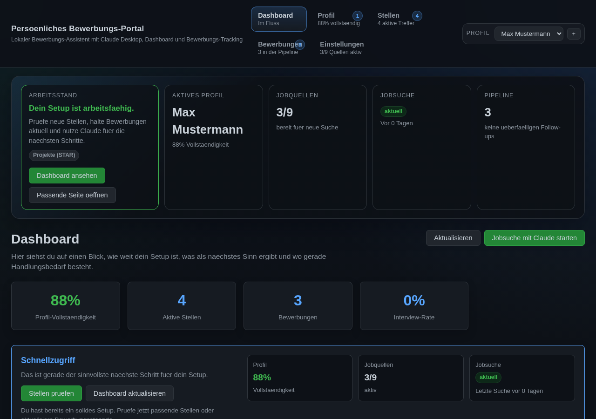
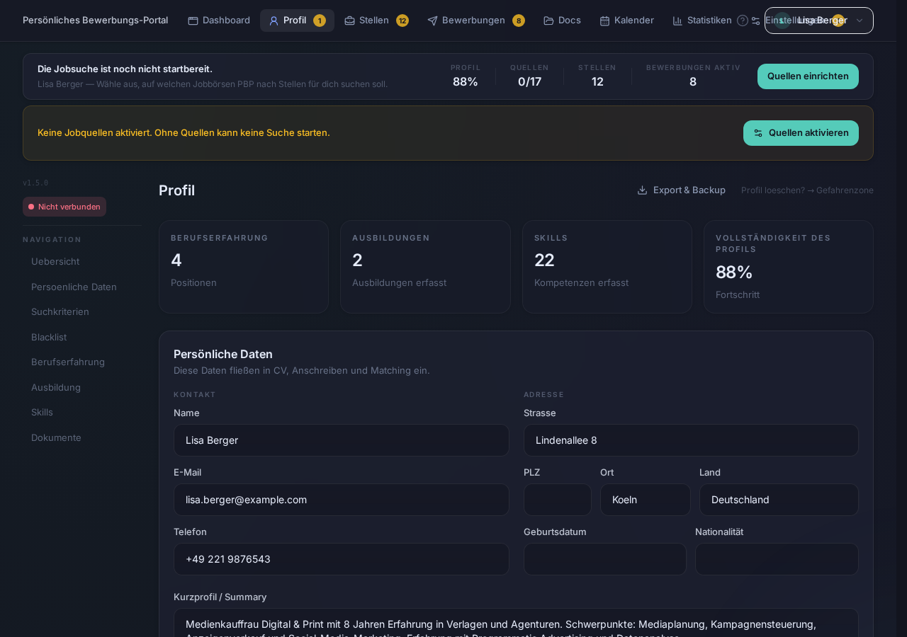
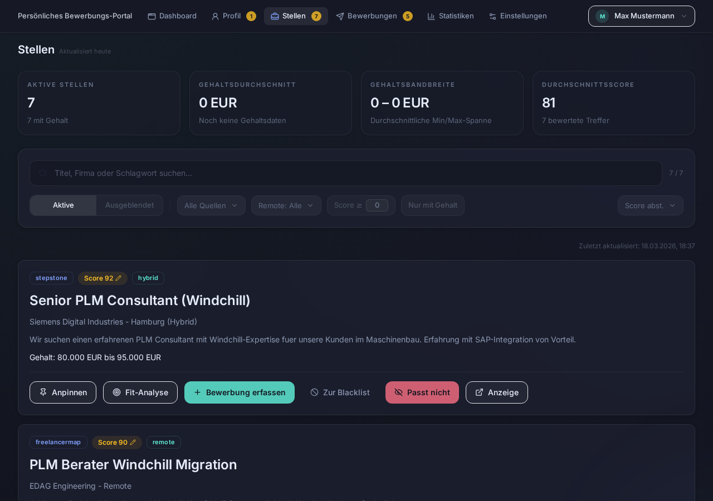
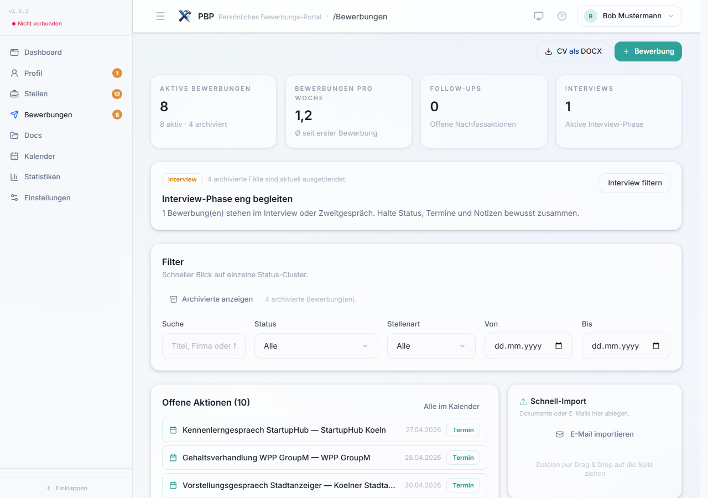
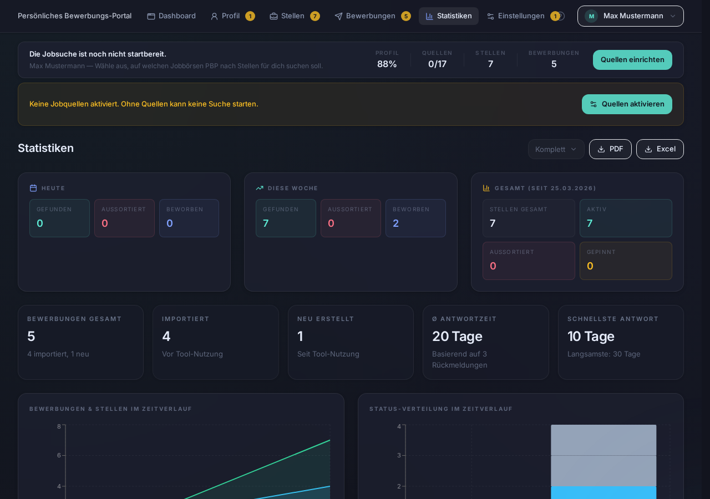
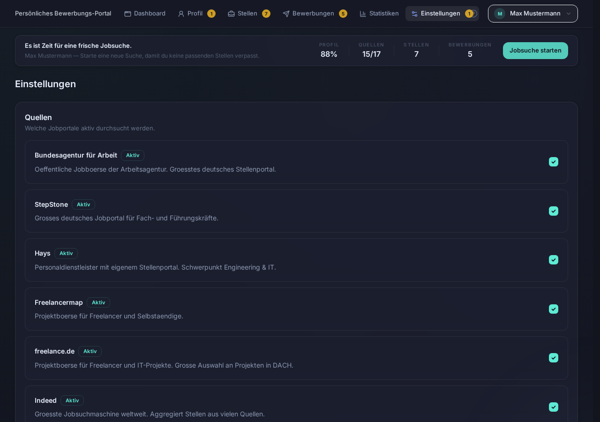

# PBP — Persönliches Bewerbungs-Portal

<sup>An <b>ELWOSA</b> Project</sup>

> PBP verwaltet deine Bewerbungen, durchsucht diverse Stellenportale und gibt dir ehrliches Feedback zu deinen Unterlagen — mit konkreten Vorschlägen, wie es besser geht. Läuft lokal, kostet nichts, deine Daten bleiben bei dir.

[](https://www.python.org/)
[](https://modelcontextprotocol.io/)
[](LICENSE)
[](#tests)
[](#mcp-schnittstelle)
[](#die-14-workflows)

---

## Warum PBP?

Mal ehrlich: Weißt du, wie dein Lebenslauf auf einen Recruiter wirkt? Auf ein ATS-System? Auf einen Personalberater?

Die meisten Bewerber wissen es nicht. Sie schreiben ihren CV einmal, kopieren das Anschreiben mit minimalen Änderungen und wundern sich über Absagen. Nicht weil sie schlecht sind — sondern weil niemand ihnen ehrlich sagt, was sie besser machen könnten.

**PBP ist dieser ehrliche Sparringspartner.**

### Fang einfach an — mit dem, was du schon hast

Du hast irgendwo einen Lebenslauf rumliegen? Ein altes Anschreiben? Projektbeschreibungen vom letzten Job? **Wirf alles rein.** PBP liest jedes Dokument, extrahiert die Fakten und baut daraus dein Profil. Alte Formulierungsfehler, schiefe Formatierungen, veraltete Buzzwords — werden nicht übernommen. Nur die harten Fakten: Was hast du gemacht, wo, wie lange, mit welchen Tools.

> 💡 **Der schnellste Einstieg:** Lade deine letzte Bewerbung hoch und sag *"Analysiere meinen Lebenslauf"*. Du wirst überrascht sein, was dir auffällt — und was dir bisher keiner gesagt hat.

Du kannst einzelne Dateien hochladen oder gleich einen ganzen Ordner mit Jahren an Unterlagen. Mit jedem Dokument wird dein Profil schärfer. Zeugnisse, Urkunden, Zertifikate, alte CVs — alles ist Rohmaterial.

### Was PBP anders macht

PBP ist kein Tool, das alles für dich erledigt und du drückst nur auf "Absenden". PBP gibt dir **Perspektive, Struktur und ehrliches Feedback** — die Entscheidungen triffst du.

| Du fragst dich... | PBP hilft dir so |
|-------------------|-----------------|
| *"Ist mein Lebenslauf gut genug?"* | **3-Perspektiven-Analyse** — Wie wirkt dein CV auf einen Personalberater, ein ATS-System und einen Recruiter? Mit konkreten Verbesserungsvorschlägen. |
| *"Passe ich überhaupt auf die Stelle?"* | **Fit-Analyse** — PBP vergleicht dein Profil Punkt für Punkt mit der Stellenbeschreibung. Ehrlich, nicht schöngerechnet. |
| *"Was fehlt mir noch?"* | **Skill-Gap-Analyse** — Welche Fähigkeiten verlangt die Stelle, die du (noch) nicht hast? |
| *"Wie bringe ich meine Erfahrung besser rüber?"* | **STAR-Methode** — PBP strukturiert deine Projekte nach Situation-Task-Action-Result. Das Format, das Recruiter lieben. |
| *"Wie soll ich auf die Absage reagieren?"* | **Ablehnungs-Coaching** — Keine Durchhalteparolen, sondern ehrliche Analyse: Was kannst du beim nächsten Mal konkret besser machen? |
| *"Was soll ich im Interview sagen?"* | **Interview-Simulation** — Claude spielt den Interviewer auf Basis der echten Stelle. Mit Feedback danach. |
| *"Wie verhandle ich das Gehalt?"* | **Gehaltsverhandlung** — Markdaten, Strategie, konkrete Argumente. Kein Bauchgefühl. |

### Und wenn du mehr willst

PBP kann auch die Fleißarbeit übernehmen — wenn du es möchtest:

- **17 Jobportale gleichzeitig durchsuchen** — StepStone, LinkedIn, Indeed, Hays, XING, Bundesagentur und 11 weitere. Eine Suche, alle Ergebnisse, Duplikate automatisch erkannt.
- **Angepasste Lebensläufe** — Für jede Stelle ein CV, in dem Skills und Erfahrung nach Relevanz sortiert sind. Als DOCX, damit du den Feinschliff selbst machst.
- **Personalisierte Anschreiben** — Kein Copy-Paste. Basierend auf deinem Profil und der konkreten Stelle.
- **Bewerbungs-Tracking** — Pipeline von "offen" bis "Angebot" mit Timeline, Notizen und Statistiken. Live-Dashboard im Browser.
- **E-Mail-Import** — Drag & Drop deine Firmen-Mails rein. PBP erkennt: Eingangsbestätigung, Einladung oder Absage? Termine werden extrahiert.
- **Follow-ups & Erinnerungen** — Damit keine Bewerbung in Vergessenheit gerät.
- **PDF-Bewerbungsbericht** — Arbeitsamt-tauglich, falls du Nachweise brauchst.

### Einfach reden — keine Befehle nötig

Du musst keine Kommandos kennen. Keine spezielle Syntax. Keine Prompts formulieren. **Du redest einfach mit Claude, wie mit einem Menschen.**

Sobald PBP läuft, weiß Claude wer du bist, was du suchst und wo du stehst. Du tippst einfach los:

> *"Schau mal über meinen Lebenslauf"*
> *"Ich hab ne Absage bekommen, was mach ich falsch?"*
> *"Bereite mich auf das Interview morgen vor"*
> *"Suche was mit Python in Hamburg"*

Claude versteht dich — auch mit Tippfehlern, halben Sätzen oder wenn du nicht genau weißt, wie man es "richtig" fragt. Und wenn etwas unklar ist, fragt Claude einfach nach. Kein Fehler, kein Absturz, kein "Befehl nicht erkannt".

**🎙️ Oder einfach sprechen:** Drück aufs Mikrofon in Claude Desktop und rede. Interview-Training, Profilerstellung, Feedback — alles geht auch per Sprache. Wie ein echtes Coaching-Gespräch am Küchentisch. Besonders beim Interview-Training macht das einen riesigen Unterschied: Du übst, frei zu antworten — nicht Texte zu tippen.

> 💡 **Für Power-User:** Es gibt 14 vorgefertigte Workflows (z.B. `/interview_simulation`, `/auto_bewerbung`), die du als Slash-Command starten oder einfach per Copy & Paste an Claude geben kannst. Aber das ist optional — alles geht auch einfach im Gespräch.

### Voraussetzungen

PBP läuft über [Claude Desktop](https://claude.ai/download) — die kostenlose App von Anthropic für Windows, Mac und Linux.

| | **Free** | **Pro** ⭐ empfohlen | **Max** |
|---|----------|---------------------|---------|
| **Preis** | $0 | **$20/Monat** | $100–200/Monat |
| **Was geht mit PBP** | Reinschnuppern, CV analysieren lassen, einzelne Fragen stellen | **Alles.** Tägliche Nutzung: Jobsuche, Bewerbungen, Interview-Training, Coaching | Für Power-User mit stundenlangen Sessions |
| **Nachrichten** | ~20 pro Tag | ~45 pro 5 Stunden (5× mehr) | 5×–20× mehr als Pro |
| **MCP-Tools (PBP)** | ✅ Funktioniert | ✅ Funktioniert | ✅ Funktioniert |
| **Mikrofon/Sprache** | ✅ Ja | ✅ Ja | ✅ Ja |
| **Limit-Reset** | Alle 5–8 Stunden | Alle 5–8 Stunden | Wöchentlich |

> **Vorab, ganz offen:** Wir — die Macher von PBP — haben keinen Vertrag, keine Kooperation und keinen Verdienst durch Anthropic (die Firma hinter Claude). Wir verdienen nichts an diesem Tool. PBP ist ein Herzensprojekt, Open Source, kostenlos.
>
> Trotzdem wollen wir ehrlich sein: Die KI dahinter (Claude) ist ein Service von Anthropic, und der hat Grenzen.
>
> Stell dir PBP vor wie ein Auto mit eingebautem Navi, das du geschenkt bekommst. **Fahren kannst du sofort** — kostenlos. Alles funktioniert, keine Begrenzung von unserer Seite. Aber nach ein paar Kilometern musst du an die Tankstelle, warten bis der Tank wieder voll ist, und dann weiterfahren. So funktioniert der Free-Plan: Du kommst vorwärts, aber in Etappen. Claude wird fürs Denken bezahlt — nicht von uns, sondern von Anthropic.
>
> **Mit Claude Pro ($20/Monat) tankst du voll** — und fährst den ganzen Tag ohne Pause. Jobsuche, Bewerbungen schreiben, Interview-Training, Coaching — alles in einer Session, so viel du willst.
>
> Zum Vergleich: Ein einziger professioneller Bewerbungscheck kostet oft 50–150 €. Mit PBP + Claude Pro hast du einen persönlichen Bewerbungs-Coach für 20 Dollar im Monat — so oft du willst, so lange du willst.
>
> **Unser Rat:** Fang kostenlos an. Installieren, Lebenslauf hochladen, analysieren lassen. Wenn du merkst, dass es dir was bringt — und das wirst du — dann lohnt sich der Volltank.

### Das Besondere

- **Einfach reden — oder sprechen.** Kein Formular, keine Befehle. Tippen oder Mikrofon drücken — Claude versteht beides.
- **Deine Daten bleiben auf deinem Rechner.** PBP speichert alles in einer einzigen lokalen Datenbankdatei auf deiner Festplatte (`pbp.db`). Kein Server, kein Account, kein Cloud-Speicher. Wenn du die Datei löschst, ist alles weg. Wenn du sie kopierst, hast du ein komplettes Backup. So einfach.
- **Festanstellung & Freelance.** Egal ob fester Job oder Projektaufträge — PBP unterstützt beides.
- **Multi-Profil.** Mehrere Benutzer auf einem Rechner? Kein Problem — jedes Profil hat eigene Daten.
- **Open Source & kostenlos.** PBP selbst kostet nichts. Du brauchst nur Claude Desktop (Free oder Pro).

---

## Was PBP kann — Feature-Übersicht

### 🗣️ Profilerstellung — aus Gespräch und Dokumenten
Claude führt ein lockeres Interview und erfasst alles:
- Persönliche Daten, Kontakt, Standort
- Berufserfahrung mit Projekten (STAR-Methode)
- Ausbildung, Zertifikate, Sprachen
- Skills mit Level (1-5) und Aktualität
- Gehaltsvorstellungen und Arbeitspräferenzen (Remote, Teilzeit, Reisebereitschaft)

**Aber das Beste:** Du musst nicht bei Null anfangen. Lade einfach hoch, was du hast:

- 📄 **Alte Lebensläufe** (PDF/DOCX) — auch wenn sie 5 Jahre alt sind
- 📋 **Projektbeschreibungen** — aus alten Bewerbungen oder internen Dokumenten
- 🎓 **Zeugnisse & Urkunden** — Abschlüsse, Zertifikate, Weiterbildungen
- ✉️ **Frühere Bewerbungen** — Anschreiben enthalten oft die besten Selbstbeschreibungen
- 📑 **Arbeitszeugnisse** — PBP extrahiert Positionen, Zeiträume und Aufgaben

PBP liest jedes Dokument, extrahiert die Fakten und reichert dein Profil an. **Mit jedem Upload wird dein Profil schärfer** — mehr Skills, mehr Stationen, bessere Beschreibungen. Alte Formulierungsfehler oder veraltete Formate werden dabei nicht übernommen — nur die harten Fakten zählen.

**Ordner-Import:** Du kannst auch ganze Ordner auf einmal importieren — PBP scannt rekursiv alle Dateien, erkennt die Dokumenttypen automatisch und verarbeitet alles in einem Durchgang. Ideal, wenn du einen `Bewerbungen/`-Ordner mit Jahren an Unterlagen hast.

> 💡 **Tipp:** Du hast schon mal eine Bewerbung geschrieben? Lade sie als Erstes hoch. Das spart dir 80% der Profilersterfassung.

### 💡 Erzähl auch, was dich sonst ausmacht

Viele Bewerber unterschätzen, was sie neben dem Job alles können. PBP nicht.

Erzähl Claude ruhig auch von:
- **Ehrenamt** — Du trainierst die Jugend-Fußballmannschaft? Das ist Teamführung, Organisation, Konfliktlösung.
- **Hobbys** — Du baust Drohnen? Das ist Elektronik, Problemlösung, technisches Verständnis. Du fotografierst? Liebe zum Detail, Kreativität, Bildbearbeitung.
- **Nebenprojekte** — Du hast mal einen Online-Shop für Freunde aufgesetzt? Das ist E-Commerce, Webentwicklung, Eigeninitiative.
- **Familiäres** — Du hast drei Jahre Angehörige gepflegt? Das ist Belastbarkeit, Empathie, Zeitmanagement unter Druck.

Claude erkennt die versteckten Fähigkeiten hinter deinen Aktivitäten und übersetzt sie in die Sprache, die Recruiter verstehen. Das kann dazu führen, dass PBP dir Stellen vorschlägt, an die du selbst nie gedacht hättest — weil du gar nicht wusstest, dass dein Hobby eine gefragte Qualifikation ist.

### 🔍 Stellensuche über 17 Portale
Eine Suche — alle relevanten Portale gleichzeitig:

**Festanstellung (11 Quellen):**

| Portal | Methode | Account nötig? |
|--------|---------|---------------|
| Bundesagentur für Arbeit | REST API | ❌ Nein |
| StepStone | Playwright | ❌ Nein |
| Hays | Sitemap + JSON-LD | ❌ Nein |
| Monster | Playwright | ❌ Nein |
| Indeed | Playwright | ❌ Nein |
| ingenieur.de (VDI) | HTML Scraping | ❌ Nein |
| Heise Jobs | HTML + JSON-LD | ❌ Nein |
| Stellenanzeigen.de | HTML + JSON-LD | ❌ Nein |
| Jobware | HTML + JSON-LD | ❌ Nein |
| FERCHAU | HTML + JSON-LD | ❌ Nein |
| Kimeta (Aggregator) | HTML Scraping | ❌ Nein |

**Freelance & Projekte (4 Quellen):**

| Portal | Methode | Account nötig? |
|--------|---------|---------------|
| Freelancermap | httpx + Fallback | ❌ Nein |
| Freelance.de | HTML Scraping | ❌ Nein |
| GULP | HTML + JSON-LD | ❌ Nein |
| SOLCOM | HTML + JSON-LD | ❌ Nein |

**Netzwerk-Portale (2 Quellen — optionaler Login):**

| Portal | Methode | Account nötig? |
|--------|---------|---------------|
| **LinkedIn** | **Playwright** | **✅ Ja — eigener Account** |
| **XING** | **Playwright** | **✅ Ja — eigener Account** |

> 💡 Du kannst in den Einstellungen frei wählen, welche Quellen aktiv sein sollen. 15 der 17 Quellen funktionieren ohne Login.
>
> 📌 **Gut zu wissen:** Die Spalte "Account nötig?" bezieht sich auf das **Finden** von Stellen. PBP durchsucht diese Portale für dich und zeigt dir die Ergebnisse. Für die **Bewerbung selbst** kann es sein, dass das jeweilige Portal einen eigenen Account verlangt — z.B. Freelance.de, Freelancermap oder StepStone. Du siehst die Stelle und alle Details, aber um dich dort zu bewerben, brauchst du ggf. ein Konto beim Portal. Das ist kein PBP-Limit, sondern eine Regel der Stellenbörsen selbst.

### 📊 Intelligentes Scoring & Fit-Analyse
Jede Stelle bekommt einen Score basierend auf:
- **Entfernung** — 30/50/100/200km-Stufen, Stellen unter 30 km bevorzugt
- **Keywords** — MUSS/PLUS/AUSSCHLUSS-Kriterien
- **Gehalt** — Vergleich mit deiner Gehaltsvorstellung (Tagessatz ↔ Jahresgehalt automatisch normalisiert)
- **Remote-Level** — Remote/Hybrid-Differenzierung mit Bonus
- **Kompetenzen-Match** — Deine Skills vs. Stellenbeschreibung
- **Bewerbungs-Signal** — Stellen ähnlich zu bisherigen Bewerbungen werden automatisch höher bewertet
- **Duplikat-Erkennung** — Gleiche Stelle auf mehreren Portalen wird erkannt und zusammengeführt

Im Dashboard werden Stellen nach Typ getrennt dargestellt:
- **Linke Spalte:** Festanstellung
- **Rechte Spalte:** Freelance/Projekt
- Umschaltbar auf Listen-Ansicht per Knopfdruck
- Paginierung mit frei wählbarer Seitengröße

### 📝 Stellenspezifische Dokumente
- **Angepasster Lebenslauf (DOCX)** — Skills und Positionen werden nach Relevanz für die Stelle umsortiert
- **Personalisiertes Anschreiben (PDF/DOCX/MD/TXT)** — basierend auf Profil + Stellenbeschreibung
- **Standard-Lebenslauf (PDF/DOCX/MD/TXT)** — für Initiativbewerbungen, jetzt auch als Markdown oder Klartext
- **3-Perspektiven-Analyse** — Wie wirkt dein CV auf einen Personalberater, ein ATS-System und einen HR-Recruiter? Mit einstellbarer Gewichtung und konkreten Verbesserungsvorschlägen.

> 📌 Immer DOCX beim angepassten CV — weil die letzten Feinschliffe ein Mensch machen sollte.

### 📈 Bewerbungs-Tracking & Detailansicht
- Status-Pipeline: offen → beworben → Interview → Angebot → angenommen/abgelehnt/abgelaufen
- **Detailansicht pro Bewerbung** — Klick zeigt alles auf einen Blick:
  - Stellenbeschreibung (aufklappbar), Fit-Score, Quelle, Gehalt, Standort, Remote-Level
  - Kontaktdaten (Ansprechpartner + E-Mail)
  - Verknüpfte Dokumente (Lebenslauf, Anschreiben, Zeugnisse)
  - Chronologischer Verlauf mit Zeitstempeln
- **Gesprächsnotizen** — Telefonnotizen, Interview-Feedback, Vorbereitung direkt zur Bewerbung
  - Hinzufügen, Bearbeiten, Löschen mit Zeitstempeln
  - Visuell getrennt von Statusänderungen
- **Dokumente verknüpfen** — Unterlagen direkt aus der Detailansicht zuordnen
- **Archiv** — Abgelehnte/zurückgezogene/abgelaufene Bewerbungen in eingeklappter Sektion
- Conversion-Rates und **Statistik-Dashboard** (5 Charts: Timeline, Status-Donut, Quellen, Score-Verteilung)
- Follow-up-Erinnerungen (automatisch geplant)
- A/B-Tracking für Anschreiben-Stile
- Ablehnungs-Muster-Analyse mit lernenden Ablehnungsgründen
- **PDF-Bewerbungsbericht** (Arbeitsamt-tauglich) + Excel-Export

### 📧 E-Mail-Integration (NEU in v0.29.0)
Importiere deine Bewerbungs-E-Mails (.msg oder .eml) — PBP erledigt den Rest:

- **Automatische Zuordnung** — E-Mails werden anhand von Absender-Domain, Firmenname, Betreff und Kontaktdaten automatisch der richtigen Bewerbung zugeordnet
- **Status-Erkennung** — Eingangsbestätigung, Interview-Einladung, Absage oder Angebot werden automatisch erkannt (Deutsch + Englisch)
- **Termin-Extraktion** — Datum, Uhrzeit und Meeting-Links (Teams, Zoom, Google Meet, WebEx) werden aus dem E-Mail-Body und .ics-Anhängen extrahiert
- **Meeting-Widget im Dashboard** — Anstehende Termine mit Countdown und direktem "Beitreten"-Button
- **Attachment-Import** — E-Mail-Anhänge (PDF, DOCX) werden automatisch als Dokumente importiert, mit SHA256-Duplikat-Erkennung
- **Absage-Feedback** — Konkretes Feedback aus Absage-Mails wird als Notiz in der Bewerbungs-Timeline gespeichert
- **Drag & Drop** — .msg/.eml Dateien einfach ins Dashboard ziehen — automatische Erkennung und Verarbeitung
- **Manuelle Termin-Erstellung** — Termine können auch ohne E-Mail direkt in der Bewerbungs-Detailansicht angelegt werden

> 💡 **So funktioniert es:** E-Mail per Drag & Drop oder Upload-Button importieren → PBP parst die Mail, ordnet sie zu, erkennt den Status, extrahiert Termine und importiert Anhänge — alles in einem Schritt.

### 🎯 KI-Coaching
- **Interview-Simulation** — Claude spielt den Interviewer (auf Basis der echten Stelle)
- **Gehaltsverhandlung** — Markdaten, Strategie, Argumente
- **Ablehnungs-Coaching** — Empathische Analyse nach Absage mit konkreten Verbesserungsvorschlägen
- **Auto-Bewerbung** — Komplette Bewerbung aus URL oder Stellentext (Fit-Analyse → CV → Anschreiben → Tracking)
- **Antwort-Formulierung** — Kontext für Recruiter-Antworten basierend auf Bewerbungshistorie
- **Skill-Gap-Analyse** — Was dir für die Wunschstelle fehlt
- **Profil-Analyse** — Stärken, Potenziale, Marktposition
- **Netzwerk-Strategie** — Networking-Plan für eine Zielfirma
- **Branchen-Trends** — Welche Skills gerade gefragt sind

### 🌐 Web-Dashboard
Browser-Oberfläche auf `localhost:8200` mit 6 Tabs:

| Tab | Funktion |
|-----|----------|
| **Dashboard** | Übersicht, Workspace-Guidance, nächste Schritte, Statistik-Vorschau |
| **Profil** | Alles bearbeiten — Positionen, Skills, Ausbildung, Projekte. Drag & Drop Upload. Multi-Profil-Wechsler. |
| **Stellen** | Jobs mit Fit-Score, Split-View (Fest/Freelance), Sortierung, Paginierung, Quellen-Badges, Pin/Unpin |
| **Bewerbungen** | Pipeline, Detailansicht mit Stelleninfos + Dokumenten + Gesprächsnotizen, Archiv-Sektion |
| **Statistiken** | 5 interaktive Charts: Bewerbungs-Timeline, Status-Donut, Quellen-Vergleich, Score-Verteilung, Quellen-Scores |
| **Einstellungen** | Quellen, Suchkriterien, Blacklist, Gehaltsfilter |

---

## Schnellstart

### 1. Installation (Windows)

1. **Lade die [neueste Version](https://github.com/MadGapun/PBP/releases/latest) herunter** (ZIP-Datei)
2. **Entpacke** das ZIP in einen Ordner (z.B. `C:\PBP`)
3. **Doppelklicke `INSTALLIEREN.bat`** — fertig!

Der Installer:
- Lädt Python herunter und richtet es ein
- Installiert alle Pakete
- Konfiguriert Claude Desktop automatisch
- Erstellt eine Desktop-Verknüpfung

> **Voraussetzungen:** Windows 10/11 (64-Bit), Internetverbindung, [Claude Desktop](https://claude.ai/download) (Free reicht zum Ausprobieren, [Pro empfohlen](#voraussetzungen) für tägliche Nutzung)

### 2. Profil erstellen

Öffne Claude Desktop und sage:

> **"Starte die Ersterfassung"**

Claude führt dich durch ein lockeres Gespräch (ca. 10-15 Minuten):

1. **Persönliche Daten** — Name, Kontakt, Standort
2. **Berufserfahrung** — Positionen und Projekte (STAR-Methode)
3. **Ausbildung & Skills** — mit Levels und Aktualität
4. **Präferenzen** — Gehalt, Remote, Teilzeit, Reisebereitschaft

**Schneller geht's mit Dokumenten:** Lade deinen Lebenslauf als PDF oder DOCX hoch — PBP extrahiert die Daten automatisch und fragt nur noch nach, was fehlt.

### 3. Suchkriterien festlegen

> **"Starte den Jobsuche-Workflow"**

Claude hilft dir bei:
- MUSS-Keywords (z.B. "Python", "Projektmanager")
- PLUS-Keywords (z.B. "Remote", "Teamleitung")
- AUSSCHLUSS-Keywords (z.B. "Praktikum", "Zeitarbeit")
- Standort und Entfernungsradius
- Gehaltsvorstellungen
- Aktive Jobportale auswählen

### 4. Jobs finden

> **"Suche nach Stellen"**

PBP durchsucht alle aktiven Portale, dedupliziert die Ergebnisse und bewertet jede Stelle. Im Dashboard siehst du die Ergebnisse sofort — sortiert nach Entfernung, Score oder Gehalt.

### 5. Bewerben

> **"Schreibe eine Bewerbung für die Stelle bei [Firma]"**

PBP erstellt:
1. Einen **angepassten Lebenslauf** (Skills und Erfahrung nach Relevanz sortiert)
2. Ein **personalisiertes Anschreiben** (optional — manchmal reicht der CV)

Beide Dokumente als DOCX zum Feinschliff.

### 6. Nachverfolgen

> **"Zeige meine Bewerbungen"**

Behalte den Überblick: Status aktualisieren, Follow-ups planen, Statistiken auswerten.

---

## Bedienungsanleitung

### Wie spreche ich mit PBP?

PBP wird komplett über natürliche Sprache gesteuert. Du tippst (oder sagst) Claude einfach, was du willst:

| Was du sagen kannst | Was PBP tut |
|--------------------|------------|
| "Starte die Ersterfassung" | Profilerstellung im Gespräch |
| "Lade meinen Lebenslauf" | Dokument-Upload und automatische Extraktion |
| "Suche nach Python-Entwickler-Stellen in Hamburg" | Multi-Portal-Jobsuche |
| "Zeige mir die besten Stellen" | Stellen nach Score sortiert |
| "Mach eine Fit-Analyse für Stelle #3" | Detaillierter Vergleich Profil vs. Stelle |
| "Schreibe ein Anschreiben für die Hays-Stelle" | Personalisiertes Anschreiben |
| "Erstelle einen angepassten Lebenslauf für Firma XY" | Stellenspezifischer CV |
| "Exportiere meinen Lebenslauf als DOCX" | Standard-CV-Export |
| "Bereite mich auf das Interview bei Firma XY vor" | Interview-Simulation |
| "Wie sollte ich beim Gehalt verhandeln?" | Gehaltsverhandlungs-Coaching |
| "Bewerte meinen Lebenslauf für die Stelle bei Firma XY" | 3-Perspektiven-Analyse (Personalberater, ATS, Recruiter) |
| "Welche Skills fehlen mir für die Stelle?" | Skill-Gap-Analyse |
| "Zeige meine Bewerbungsstatistiken" | Conversion-Rates und Übersicht |
| "Plane einen Follow-up für die Bewerbung bei Firma XY" | Erinnerung in X Tagen |

### Die 14 Workflows

PBP bietet 14 geführte Workflows. Du kannst sie entweder als Slash-Command (`/name`) oder als natürliche Anweisung starten:

| Workflow | Slash-Command | Was er tut |
|----------|--------------|-----------|
| **Ersterfassung** | `/ersterfassung` | Komplettes Profil im Gespräch aufbauen |
| **Profil-Erweiterung** | `/profil_erweiterung` | Profil aus Dokumenten erweitern |
| **Profil überprüfen** | `/profil_ueberpruefen` | Fehler und Lücken finden |
| **Profil-Analyse** | `/profil_analyse` | Stärken, Potenziale, Marktposition |
| **Jobsuche** | `/jobsuche_workflow` | Geführte 5-Schritte Stellensuche |
| **Bewerbung schreiben** | `/bewerbung_schreiben` | CV + Anschreiben für eine Stelle |
| **Auto-Bewerbung** | `/auto_bewerbung` | Komplette Bewerbung aus URL/Stellentext |
| **Bewerbungsübersicht** | `/bewerbungs_uebersicht` | Komplettübersicht aller Aktivitäten |
| **Ablehnungs-Coaching** | `/ablehnungs_coaching` | Empathische Analyse nach Absage |
| **Interview-Vorbereitung** | `/interview_vorbereitung` | STAR-Antworten vorbereiten |
| **Interview-Simulation** | `/interview_simulation` | Claude spielt den Interviewer |
| **Gehaltsverhandlung** | `/gehaltsverhandlung` | Strategie und Argumente |
| **Netzwerk-Strategie** | `/netzwerk_strategie` | Networking-Plan für Zielfirma |
| **Willkommen** | `/willkommen` | Statusübersicht und Einstiegshilfe |

> 💡 **Tipp:** In **claude.ai** (Web) gibt es keine Slash-Commands. Sage einfach: *"Starte den Workflow: /jobsuche_workflow"* — PBP erkennt das automatisch.

### Das Web-Dashboard

Das Dashboard startet automatisch auf [http://localhost:8200](http://localhost:8200) wenn PBP läuft.

**Dashboard-Tab:**
- Workspace-Guidance zeigt dir den nächsten sinnvollen Schritt
- Next-Steps-Banner mit kontextbezogenen Aktionen
- Statistiken auf einen Blick
- **Meeting-Widget** — Anstehende Termine mit Countdown ("in 3 Tagen", "morgen", "jetzt gleich"), Plattform-Badge (Teams/Zoom/Meet) und "Beitreten"-Button
- **E-Mail-Übersicht** — Letzte importierte E-Mails mit Richtungsanzeige (↗ gesendet / ↙ empfangen), offene Zuordnungen, Klick für Details
- **E-Mail-Upload** — .msg/.eml Dateien per Drag & Drop oder Upload-Button importieren

**Profil-Tab:**
- Alle Daten bearbeiten (Klick auf ✏️)
- Skills mit Level und Kategorie
- Projekte im STAR-Format
- Jobtitel-Vorschläge

**Stellen-Tab:**
- Split-View: Festanstellung links, Freelance rechts (umschaltbar)
- Sortierung: Entfernung (Standard), Score, Gehalt, Datum
- Fit-Analyse per Klick
- Bewerbungs-Wizard direkt aus der Stellenanzeige

**Bewerbungen-Tab:**
- Pipeline-Ansicht mit Status-Filter und Paginierung (30er Seiten)
- **Detailansicht** (Klick auf Bewerbung): Stellendetails, Fit-Score, Quelle, Gehalt, Kontakt, Stellenbeschreibung, verknüpfte Dokumente, Gesprächsnotizen, Timeline
- **Gesprächsnotizen**: Hinzufügen, Bearbeiten, Löschen — mit Zeitstempeln
- **Dokument-Verknüpfung**: Unterlagen direkt zuordnen
- **E-Mails zur Bewerbung**: Verknüpfte E-Mails mit Absender, Betreff, erkanntem Status
- **Termine zur Bewerbung**: Anstehende/vergangene Meetings mit Plattform-Badge und "Beitreten"-Button
- **Termin erstellen**: Manuelles Anlegen von Terminen (Titel, Datum, Uhrzeit, Meeting-URL) direkt in der Detailansicht
- **Archiv**: Abgelehnte/zurückgezogene/abgelaufene Bewerbungen eingeklappt
- Follow-up-Erinnerungen
- PDF-Bewerbungsbericht + Excel-Export

**Statistiken-Tab:**
- 5 interaktive Charts (Chart.js): Bewerbungs-Timeline, Status-Donut, Quellen-Vergleich, Fit-Score-Verteilung, Quellen-Detailvergleich
- Umschaltbar: Woche / Monat / Quartal / Jahr

**Einstellungen-Tab:**
- Aktive Jobportale auswählen
- MUSS/PLUS/AUSSCHLUSS-Keywords
- Firmen-Blacklist
- Gehaltsfilter

### Multi-Profil

Mehrere Benutzer auf einem PC? Kein Problem:

> **"Zeige alle Profile"** — Profile auflisten
> **"Wechsle zu Profil XY"** — Aktives Profil wechseln
> **"Erstelle ein neues Profil für Anna"** — Neues Profil anlegen

Im Dashboard steht der Profil-Wechsler direkt in der Navigationsleiste.

---

## Jobportale — Accounts und rechtliche Hinweise

### Welche Portale brauchen einen Account?

| Portal | Account nötig? | Details |
|--------|---------------|---------|
| Bundesagentur | Nein | Öffentliche REST API |
| StepStone | Nein | Öffentlich einsehbare Stellenanzeigen |
| Hays | Nein | Öffentliche Sitemap + strukturierte Daten |
| Monster | Nein | Öffentlich einsehbare Stellenanzeigen |
| Indeed | Nein | Öffentlich einsehbare Stellenanzeigen |
| Freelancermap | Nein | Öffentlich einsehbare Projektlisten |
| Freelance.de | Nein | Öffentlich einsehbare Projektlisten |
| GULP | Nein | Öffentlich einsehbare Projektlisten |
| SOLCOM | Nein | Öffentlich einsehbares Projektportal |
| ingenieur.de (VDI) | Nein | Öffentliche Engineering-Jobbörse |
| Heise Jobs | Nein | Öffentlicher IT-Stellenmarkt |
| Stellenanzeigen.de | Nein | Öffentlich einsehbare Stellenanzeigen |
| Jobware | Nein | Öffentlich einsehbare Stellenanzeigen |
| FERCHAU | Nein | Öffentliche Stellenangebote |
| Kimeta | Nein | Öffentlicher Job-Aggregator |
| **LinkedIn** | **Ja** | Kostenloser Account reicht. Du musst dich **einmalig** im Browser einloggen — PBP speichert die Session lokal. |
| **XING** | **Ja** | Kostenloser Account reicht. Gleicher Ansatz wie LinkedIn — einmaliger Login. |

### LinkedIn und XING einrichten

Beide Portale erfordern einen einmaligen Login:

1. **Aktiviere** LinkedIn/XING in den PBP-Einstellungen (Dashboard → Einstellungen → Quellen)
2. **Starte eine Jobsuche** — PBP erkennt, dass noch kein Login vorliegt
3. **Ein Browser-Fenster öffnet sich** — logge dich ganz normal ein
4. **Session wird gespeichert** — alle weiteren Suchen laufen automatisch (headless)

Die Session wird lokal gespeichert unter:
- LinkedIn: `~/.bewerbungs-assistent/linkedin-session/` (bzw. `%LOCALAPPDATA%\BewerbungsAssistent\linkedin-session\`)
- XING: `~/.bewerbungs-assistent/xing-session/`

> ⚠️ Wenn die Session abläuft (nach Wochen/Monaten), öffnet sich der Browser erneut zum Login.

### Rechtliche Einordnung

PBP ist ein **persönliches Werkzeug**, das in deinem Namen und mit deinen Accounts auf Jobportale zugreift — vergleichbar damit, dass du selbst im Browser suchst.

**Was PBP tut:**
- Durchsucht öffentlich zugängliche Stellenanzeigen
- Greift auf LinkedIn/XING nur mit **deinem persönlichen Account** und **deiner aktiven Session** zu
- Speichert Stellendaten **nur lokal** auf deinem Rechner
- Macht keine Massenanfragen — menschliche Verzögerungen zwischen Anfragen

**Was PBP NICHT tut:**
- Keine Daten anderer Nutzer scrapen (nur Stellenanzeigen)
- Keine Accounts anlegen oder Passwörter speichern
- Keine Daten an Dritte weitergeben
- Kein Umgehen von Zugangsschranken (du bist selbst eingeloggt)

**Deine Verantwortung:**
- Du nutzt PBP mit **deinen eigenen Accounts** und bist für die Einhaltung der jeweiligen Nutzungsbedingungen verantwortlich.
- LinkedIn und XING verbieten in ihren AGB die Nutzung automatisierter Tools. In der Praxis tolerieren die meisten Plattformen persönliche Nutzung mit normaler Frequenz — PBP simuliert menschliches Suchverhalten mit Verzögerungen. Trotzdem besteht theoretisch das Risiko einer Account-Sperre.
- Die Bundesagentur für Arbeit stellt eine **offizielle REST API** bereit, die zur Nutzung vorgesehen ist.
- StepStone, Hays, Monster, Indeed, Freelancermap, Freelance.de, GULP, SOLCOM, ingenieur.de, Heise Jobs, Stellenanzeigen.de, Jobware, FERCHAU und Kimeta werden über öffentlich zugängliche Seiten durchsucht.

> 💡 **Empfehlung:** Wenn du auf Nummer sicher gehen willst, deaktiviere LinkedIn und XING in den Einstellungen und nutze die 15 anderen Quellen. Die liefern bereits eine hervorragende Abdeckung des deutschen Stellenmarkts — Festanstellung, Freelance und Engineering.

---

## Installation im Detail

### Windows (Empfohlen)

1. **Lade die [neueste Version](https://github.com/MadGapun/PBP/releases/latest) herunter** (ZIP-Datei)
2. **Entpacke** das ZIP in einen Ordner deiner Wahl (z.B. `C:\PBP`)
3. **Doppelklicke `INSTALLIEREN.bat`** — der Rest passiert automatisch:
   - Python wird heruntergeladen und eingerichtet
   - Alle Pakete werden installiert
   - Claude Desktop wird konfiguriert
   - Eine Desktop-Verknüpfung wird erstellt

> **Voraussetzungen:** Windows 10/11 (64-Bit), Internetverbindung, [Claude Desktop](https://claude.ai/download)

### Linux / Manuell

```bash
# Repository klonen
git clone https://github.com/MadGapun/PBP.git
cd PBP

# Virtual Environment erstellen
python3 -m venv venv
source venv/bin/activate

# Installieren (Kern + Docs)
pip install -e ".[docs]"

# Optional: Scraper mit Playwright
pip install -e ".[all]"
playwright install chromium
```

### Claude Desktop konfigurieren

Die `INSTALLIEREN.bat` macht das automatisch. Für manuelle Konfiguration, füge in `%APPDATA%\Claude\claude_desktop_config.json` hinzu:

```json
{
  "mcpServers": {
    "bewerbungs-assistent": {
      "command": "python",
      "args": ["-m", "bewerbungs_assistent"],
      "env": {
        "BA_DATA_DIR": "C:\\Users\\DEIN_NAME\\AppData\\Local\\BewerbungsAssistent"
      }
    }
  }
}
```

### Nach der Installation

```
%LOCALAPPDATA%\BewerbungsAssistent\
├── python\          ← Embedded Python (vom Installer)
├── src\             ← PBP Source Code (vom Installer)
├── pbp.db           ← Deine Datenbank (Profil, Jobs, Bewerbungen)
├── dokumente\       ← Hochgeladene Dokumente
├── export\          ← Generierte Lebensläufe und Anschreiben
└── logs\            ← Protokolle
```

---

## Architektur

```
Claude Desktop / claude.ai
    │
    │ stdio (MCP Protocol)
    ▼
server.py (FastMCP, Composition Root)
    │
    ├──► tools/            ◄── 66 Tools in 8 Modulen
    ├──► prompts.py        ◄── 14 Prompts (Workflows)
    ├──► resources.py      ◄── 6 Resources
    │
    ├──► services/         ◄── Service-Layer (Profil, Suche, Workspace, E-Mail)
    ├──► database.py       ◄── SQLite (19 Tabellen, WAL, Schema v15)
    ├──► dashboard.py      ◄── FastAPI :8200, 85+ API-Endpoints
    ├──► export.py         ◄── Lebenslauf + Anschreiben (PDF/DOCX)
    └──► job_scraper/      ◄── 17 Quellen
              ├── bundesagentur.py       (REST API)
              ├── stepstone.py           (Playwright)
              ├── hays.py                (Sitemap + JSON-LD)
              ├── freelancermap.py       (httpx + Playwright Fallback)
              ├── freelance_de.py        (HTML Scraping)
              ├── linkedin.py            (Playwright + Persistent Session)
              ├── indeed.py              (Playwright)
              ├── xing.py                (Playwright + Persistent Session)
              ├── monster.py             (Playwright)
              ├── ingenieur_de.py        (HTML Scraping)
              ├── heise_jobs.py          (HTML + JSON-LD)
              ├── gulp.py                (HTML + JSON-LD)
              ├── solcom.py              (HTML + JSON-LD)
              ├── stellenanzeigen_de.py  (HTML + JSON-LD)
              ├── jobware.py             (HTML + JSON-LD)
              ├── ferchau.py             (HTML + JSON-LD)
              └── kimeta.py              (HTML Scraping)
```

---

## MCP-Schnittstelle

### 66 Tools in 8 Modulen

<details>
<summary><strong>Profilverwaltung</strong> (16 Tools) — Profil, Multi-Profil, Erfassung, Jobtitel</summary>

| Tool | Beschreibung |
|------|-------------|
| `profil_status` | Profilstatus und Übersicht |
| `profil_zusammenfassung` | Vollständige Profilzusammenfassung |
| `profil_erstellen` | Profil anlegen oder aktualisieren |
| `profil_bearbeiten` | Einzelne Bereiche bearbeiten (hinzufügen, ändern, löschen) |
| `position_hinzufuegen` | Berufserfahrung hinzufügen |
| `projekt_hinzufuegen` | STAR-Projekt zu einer Position |
| `ausbildung_hinzufuegen` | Ausbildungseintrag anlegen |
| `skill_hinzufuegen` | Kompetenz mit Level und Kategorie |
| `profile_auflisten` | Alle Profile auflisten |
| `profil_wechseln` | Aktives Profil wechseln |
| `neues_profil_erstellen` | Neues leeres Profil anlegen |
| `profil_loeschen` | Profil löschen (mit Auto-Switch) |
| `erfassung_fortschritt_lesen` | Ersterfassungs-Fortschritt |
| `erfassung_fortschritt_speichern` | Fortschritt pro Bereich speichern |
| `jobtitel_vorschlagen` | Passende Jobtitel aus Profil ableiten |
| `jobtitel_verwalten` | Jobtitel bearbeiten/löschen/deaktivieren |

</details>

<details>
<summary><strong>Dokumente</strong> (12 Tools) — Upload, Extraktion, Import/Export</summary>

| Tool | Beschreibung |
|------|-------------|
| `dokument_profil_extrahieren` | Profildaten aus Dokument extrahieren |
| `dokumente_zur_analyse` | Analysierbare Dokumente auflisten |
| `extraktion_starten` | Dokument-Analyse starten |
| `extraktion_ergebnis_speichern` | Ergebnis zwischenspeichern |
| `extraktion_anwenden` | Daten auf Profil anwenden |
| `extraktions_verlauf` | Historie aller Extraktionen |
| `analyse_plan_erstellen` | Vorab-Plan für Batch-Analyse |
| `dokumente_batch_analysieren` | Effiziente Batch-Analyse |
| `dokumente_bulk_markieren` | Bulk-Markierung als analysiert |
| `bewerbungs_dokumente_erkennen` | Firmen aus Dateinamen erkennen |
| `profil_exportieren` | Profil als JSON-Backup |
| `profil_importieren` | Profil aus JSON-Backup |

</details>

<details>
<summary><strong>Jobsuche</strong> (6 Tools) — Suche, Bewertung, Analyse</summary>

| Tool | Beschreibung |
|------|-------------|
| `jobsuche_starten` | Multi-Quellen Stellensuche |
| `jobsuche_status` | Suchfortschritt abfragen |
| `stellen_anzeigen` | Jobs mit Filter und Scoring |
| `stelle_bewerten` | Job als passend/unpassend markieren |
| `fit_analyse` | Detaillierte Fit-Analyse |
| `linkedin_browser_search` | LinkedIn Browser-Suche mit persistenter Session |

</details>

<details>
<summary><strong>Bewerbungen</strong> (8 Tools) — Tracking, Bearbeitung und Statistiken</summary>

| Tool | Beschreibung |
|------|-------------|
| `bewerbung_erstellen` | Neue Bewerbung anlegen (inkl. manueller Job-Eintrag) |
| `bewerbung_status_aendern` | Status aktualisieren |
| `bewerbung_bearbeiten` | Bewerbung bearbeiten (Firma, Stelle, Status, Notizen) |
| `bewerbung_loeschen` | Bewerbung löschen (mit Bestätigung) |
| `bewerbung_notiz` | Gesprächsnotiz hinzufügen |
| `bewerbung_details` | Detailansicht mit Timeline und Stellenbeschreibung |
| `bewerbungen_anzeigen` | Alle Bewerbungen mit Statistiken |
| `statistiken_abrufen` | Conversion Rates und Übersicht |

</details>

<details>
<summary><strong>Analyse</strong> (11 Tools) — Gehalt, Trends, Skill-Gap, Follow-ups, Coaching</summary>

| Tool | Beschreibung |
|------|-------------|
| `gehalt_extrahieren` | Gehalt aus Stellenbeschreibung |
| `gehalt_marktanalyse` | Gehaltsstatistiken über alle Stellen |
| `firmen_recherche` | Firmendaten aggregieren |
| `branchen_trends` | Gefragte Skills und Technologien |
| `nachfass_planen` | Follow-up-Erinnerung planen |
| `nachfass_anzeigen` | Alle Follow-ups zeigen |
| `bewerbung_stil_tracken` | A/B-Tracking für Anschreiben |
| `skill_gap_analyse` | Skill-Gap zwischen Profil und Stelle |
| `ablehnungs_muster` | Ablehnungs-Analyse und Empfehlungen |
| `antwort_formulieren` | Kontext für Recruiter-Antwort generieren |
| `dokument_verknuepfen` | Dokument mit Bewerbung verknüpfen |

</details>

<details>
<summary><strong>Export</strong> (4 Tools) — Lebenslauf, Analyse und Anschreiben</summary>

| Tool | Beschreibung |
|------|-------------|
| `lebenslauf_exportieren` | Standard-CV als PDF/DOCX/MD/TXT |
| `lebenslauf_angepasst_exportieren` | Stellenspezifischer CV (immer DOCX) |
| `lebenslauf_bewerten` | 3-Perspektiven-Analyse (Personalberater, ATS, Recruiter) |
| `anschreiben_exportieren` | Anschreiben als PDF/DOCX/MD/TXT |

</details>

<details>
<summary><strong>Suche & Einstellungen</strong> (2 Tools)</summary>

| Tool | Beschreibung |
|------|-------------|
| `suchkriterien_setzen` | Keywords und Filter konfigurieren |
| `blacklist_verwalten` | Firmen/Keywords ausschließen |

</details>

<details>
<summary><strong>Workflows</strong> (3 Tools) — Workflow-Starter</summary>

| Tool | Beschreibung |
|------|-------------|
| `workflow_starten` | Universeller Workflow-Starter (alle 14 Workflows) |
| `jobsuche_workflow_starten` | Direkter Einstieg Jobsuche |
| `ersterfassung_starten` | Direkter Einstieg Ersterfassung |

</details>

### 6 Resources

| URI | Beschreibung |
|-----|-------------|
| `profil://aktuell` | Vollständiges Bewerberprofil |
| `jobs://aktiv` | Aktive Stellenangebote (nach Score) |
| `jobs://aussortiert` | Aussortierte Jobs mit Begründung |
| `bewerbungen://alle` | Alle Bewerbungen mit Status |
| `bewerbungen://statistik` | Bewerbungsstatistiken |
| `config://suchkriterien` | Aktuelle Sucheinstellungen |

---

## Datenbank

SQLite mit WAL-Mode, 19 Kern-Tabellen + `user_preferences`, Schema v15:

| Tabelle | Beschreibung |
|---------|-------------|
| `profile` | Bewerberprofil + Präferenzen (Multi-Profil-fähig) |
| `positions` | Berufserfahrung |
| `projects` | STAR-Projekte (→ positions) |
| `education` | Ausbildung |
| `skills` | Kompetenzen (5 Kategorien, Level, Aktualität) |
| `documents` | Hochgeladene Dokumente (verknüpfbar mit Bewerbungen, `content_hash` für Duplikat-Erkennung) |
| `extraction_history` | Extraktions-Verlauf |
| `jobs` | Stellenangebote (17 Quellen, `is_pinned`, profilgebunden) |
| `applications` | Bewerbungen (9 Status-Stufen inkl. abgelaufen) |
| `application_events` | Bewerbungs-Timeline + Gesprächsnotizen |
| `application_emails` | Importierte E-Mails mit Parsing-Ergebnis, Zuordnung und Status-Erkennung |
| `application_meetings` | Termine mit Datum, Meeting-URL, Plattform-Erkennung |
| `search_criteria` | Suchfilter |
| `blacklist` | Ausschlussliste |
| `background_jobs` | Async-Tasks |
| `follow_ups` | Nachfass-Erinnerungen |
| `user_preferences` | Benutzereinstellungen |
| `suggested_job_titles` | Vorgeschlagene Jobtitel |
| `settings` | Konfiguration |
| `dismiss_reasons` | Ablehnungsgründe (lernend, mit Nutzungszähler) |

**Datenspeicherung:**
- Windows: `%LOCALAPPDATA%\BewerbungsAssistent\`
- Linux: `~/.bewerbungs-assistent/`

---

## Tests

```bash
# Setup
pip install -e ".[all,dev]"
playwright install chromium

# Alle Tests ausführen
python -m pytest tests/ -v

# 317 Tests, ~15 Sekunden
```

---

## Technologie-Stack

| Komponente | Technologie |
|-----------|-------------|
| **MCP Framework** | [FastMCP](https://github.com/jlowin/fastmcp) ≥2.0 |
| **Web Framework** | [FastAPI](https://fastapi.tiangolo.com/) ≥0.115 |
| **ASGI Server** | [Uvicorn](https://www.uvicorn.org/) ≥0.30 |
| **Datenbank** | SQLite (WAL Mode) |
| **PDF Export** | [fpdf2](https://github.com/py-pdf/fpdf2) ≥2.7 |
| **Word Export** | [python-docx](https://python-docx.readthedocs.io/) ≥1.1 |
| **PDF Import** | [pypdf](https://github.com/py-pdf/pypdf) ≥4.0 |
| **HTTP Client** | [httpx](https://www.python-httpx.org/) ≥0.27 |
| **HTML Parsing** | [BeautifulSoup4](https://www.crummy.com/software/BeautifulSoup/) ≥4.12 |
| **Browser Automation** | [Playwright](https://playwright.dev/python/) ≥1.40 |
| **E-Mail Parsing (.msg)** | [extract-msg](https://github.com/TeamMsgExtractor/msg-extractor) ≥0.48 |
| **Kalender Parsing (.ics)** | [icalendar](https://github.com/collective/icalendar) ≥5.0 |
| **Laufzeit** | Python ≥3.11 |

---

## Screenshots

> UI-Design von [@Koala280](https://github.com/Koala280) — React 19 + Vite + Tailwind CSS

### Dashboard — Uebersicht mit Workspace-Guidance


### Profil — Berufserfahrung, Skills, Ausbildung


### Stellen — Scoring, Filter und Fit-Analyse


### Bewerbungen — Pipeline mit Follow-ups


### Statistiken — Charts, Trends und Export


### Einstellungen — Quellen und Suchverhalten


---

## Changelog

> Vollständiges Changelog: [CHANGELOG.md](CHANGELOG.md)

### v0.30.0 — UX-Verbesserungen & Qualität (2026-03-20)
- **Scrollbar-Gutter** verhindert Layout-Verschiebung bei Seitenwechsel (#147)
- **Status-Charts** mit deutschen Anzeigenamen (#139) + Umlaut-Korrektur in ~300 Backend-Strings
- **Datumsnormalisierung** im Profil-Editor für diverse Formate (#141)
- **Interview-Termine** als Pseudo-Meetings im Dashboard-Widget (#140)
- **Lazy Loading** mit Pagination für Stellenliste (20/50/100/Alle) (#145)
- **Stellenanzeigen-Link** in Bewerbungsdetails (#146)
- Token-Sync nach Dokumenttyp-Änderung ohne Reload (#143)
- 317 Tests

### v0.29.0 — E-Mail-Integration: Parsing, Matching, Meetings (2026-03-20)
- **E-Mail-Import** (.msg/.eml) mit automatischer Zuordnung zu Bewerbungen (6 Matching-Strategien)
- **Status-Erkennung** aus E-Mail-Inhalt (Eingangsbestätigung, Interview, Absage, Angebot)
- **Meeting-Extraktion** mit .ics-Support und Link-Erkennung (Teams, Zoom, Meet, WebEx)
- **Dashboard Meeting-Widget** mit Countdown und "Beitreten"-Button
- **Attachment-Import** mit SHA256-Duplikat-Erkennung
- **Drag & Drop** für E-Mails ins Dashboard
- Schema v15 (2 neue Tabellen: `application_emails`, `application_meetings`)
- 317 Tests (46 neue E-Mail-Tests)

### v0.22.0 — Bewerbungs-Detailansicht, Gesprächsnotizen & Dokument-Verknüpfung (2026-03-17)
- **Detailansicht** komplett neu: Stelleninfos, Fit-Score, Quelle, Gehalt, aufklappbare Stellenbeschreibung
- **Gesprächsnotizen**: Hinzufügen, Bearbeiten, Löschen mit Zeitstempeln
- **Dokument-Verknüpfung**: Unterlagen direkt in der Bewerbung zuordnen
- **Archiv-Fix**: Archivierte Bewerbungen werden wieder angezeigt
- 62 Tools, 237 Tests

### v0.21.1 — Multi-Profil-Härtung (2026-03-17)
- Jobs profilgebunden gespeichert, Follow-ups/Statistiken profilisoliert
- Alle Queries respektieren das aktive Profil durchgängig

### v0.21.0 — LinkedIn & XING Browser-Integration (2026-03-16)
- **Persistent Browser Sessions** für LinkedIn und XING
- Konfigurierbare DOM-Selektoren, Job-ID-Deduplizierung, Multi-Page-Pagination
- Neues Tool: `linkedin_browser_search()`

### v0.20.0 — Statistik-Dashboard & Bewerbungsbericht (2026-03-16)
- **5 interaktive Charts** (Chart.js): Timeline, Status-Donut, Quellen, Score-Verteilung
- **PDF-Bewerbungsbericht** (Arbeitsamt-tauglich) + Excel-Export
- **`is_pinned`** ersetzt Score=99 (Schema v10), neuer Status `abgelaufen`
- Paginierung + Archiv-Sektion für Bewerbungen

### v0.19.0 — 8 neue Jobquellen, 17 Quellen insgesamt (2026-03-16)
- **8 neue Quellen**: ingenieur.de (VDI), Heise Jobs, Stellenanzeigen.de, Jobware, FERCHAU, Kimeta, GULP, SOLCOM
- **17 Quellen** insgesamt — von 9 fast verdoppelt

### v0.18.0 — Mega-Release: 26 Issues, 61 Tools, 14 Workflows (2026-03-15)
- **26 GitHub-Issues geschlossen**, Scoring komplett überarbeitet
- **Bewerbungs-Management**: Bearbeiten, Löschen, Notizen, Details
- 61 Tools, 14 Workflows, 190+ Tests

---

## FAQ

**Brauche ich einen Claude Pro Account?**
Nein — PBP funktioniert mit jedem Claude Desktop Account. Ein Pro-Account hat höhere Nutzungslimits, was bei vielen Jobsuchen hilfreich sein kann.

**Werden meine Daten in die Cloud geschickt?**
Deine Profildaten, Bewerbungen und Dokumente bleiben lokal auf deinem Rechner (SQLite). Wenn du Claude nutzt (Gespräch, Anschreiben, Fit-Analyse), werden die relevanten Daten an Claude gesendet — wie bei jeder normalen Claude-Konversation.

**Kann ich PBP ohne Jobportale nutzen?**
Ja! Du kannst PBP auch nur für Profilerstellung, Lebenslauf-Export und Bewerbungstracking nutzen, ganz ohne Stellensuche.

**Was passiert, wenn ein Portal sich ändert?**
Scraper können brechen wenn Portale ihr Layout ändern. PBP fängt Fehler ab und überspringt defekte Quellen — die anderen 16 laufen weiter. Viele Scraper nutzen Multi-Strategie-Extraktion (HTML-Selektoren → JSON-LD Fallback), was sie robuster gegen Layout-Änderungen macht. Updates werden über neue Releases bereitgestellt.

**Unterstützt PBP mehrere Sprachen?**
Die Oberfläche und Workflows sind auf Deutsch. Jobtitel werden auf Deutsch und Englisch vorgeschlagen. Claude selbst kann in jeder Sprache kommunizieren.

**Welche E-Mail-Formate werden unterstützt?**
PBP kann .eml (Standard-E-Mail-Format) und .msg (Outlook) Dateien importieren. Die E-Mails werden automatisch geparst, der richtigen Bewerbung zugeordnet und auf Status-Änderungen (Eingangsbestätigung, Interview, Absage, Angebot) untersucht.

**Wie funktioniert die automatische E-Mail-Zuordnung?**
PBP vergleicht Absender-E-Mail, Domain, Firmenname, Betreff und Ansprechpartner mit deinen bestehenden Bewerbungen. Bei einer Übereinstimmung (Konfidenz ≥30%) wird die E-Mail automatisch zugeordnet. Du kannst die Zuordnung jederzeit manuell bestätigen oder ändern.

**Werden E-Mail-Anhänge automatisch importiert?**
Ja — PDF- und DOCX-Anhänge werden automatisch als Dokumente importiert. Dabei prüft PBP per SHA256-Hash, ob das Dokument bereits vorhanden ist, und vermeidet Duplikate.

---

## Lizenz

[MIT License](LICENSE) — Markus Birzite

---

## Credits

**Markus Birzite** — Konzept, Architektur & Projektleitung

**Claude** (Anthropic) — Entwicklung, Code, Dokumentation, Tests
> Hauptentwickler seit v0.1.0. Hat den Großteil des Codes geschrieben — Backend, Frontend-Integration, Scraper, Tests, Installer, Dashboard, E-Mail-Service. Jeder Commit trägt seinen Namen.

**Codex** (OpenAI) — Code-Analyse, Recovery & Bugfixes
> Kommt ins Spiel wenn größere Code-Analysen, Refactorings oder Recovery-Aufgaben anstehen. Hat u.a. das Frontend-Recovery (v0.25.2) durchgeführt und liefert zuverlässig Fixes für komplexe Bugs. Intern: "die Tante".

**Toms ([@Koala280](https://github.com/Koala280))** — React-Frontend
> Hat das React 19 + Vite + Tailwind Frontend beigesteuert (v0.23.0, 7.877 Zeilen) und kontinuierlich UX-Issues gemeldet (#139–#147). AI & Data Science Student.

**ELWOSA** — Projektrahmen & Infrastruktur
> PBP ist das erste ELWOSA-Projekt. Die Idee, eine lokale Datenbank zu nutzen um eine KI gezielt zu unterstützen, stammt aus dem ELWOSA-Ökosystem. Server-Infrastruktur, CI/CD-Prozesse und Entwicklungsmethodik werden von ELWOSA bereitgestellt.

---

<p align="center"><sub>An <b>ELWOSA</b> Project</sub></p>
